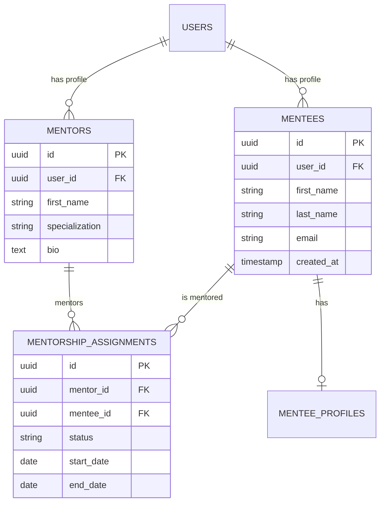
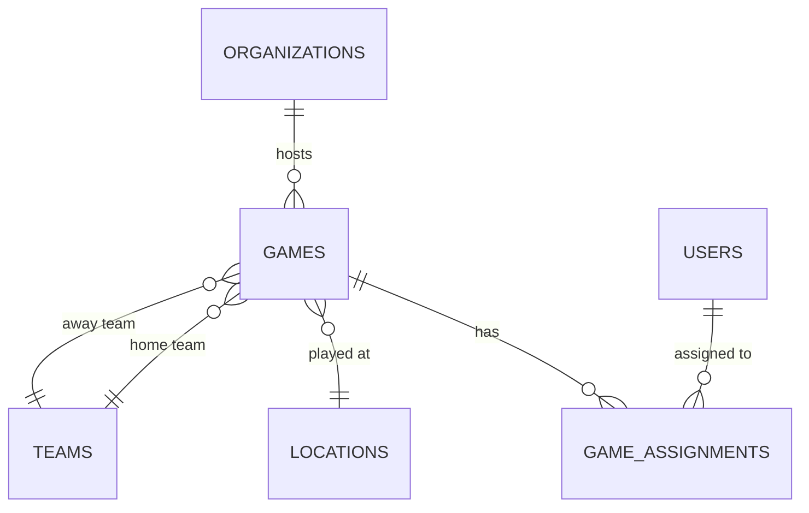

# Database Schema Analyzer

Analyzes PostgreSQL database schema to ensure quality, find issues, and keep documentation synchronized.

## Description

This skill analyzes your database schema by:
- Reading Knex migration files
- Querying the actual database (if available)
- Comparing schema to documentation
- Finding missing indexes and constraints
- Identifying performance issues
- Generating ERD diagrams

## When to use this skill

Use this skill when:
- Adding new tables or columns
- Optimizing database performance
- Updating schema documentation
- Finding missing indexes
- Validating migration consistency
- Checking for schema drift
- Before production deployments

## How to use this skill

**Examples:**
- "Analyze database schema"
- "Check for missing indexes"
- "Generate ERD for mentorship tables"
- "Compare schema to documentation"
- "Find schema drift"
- "Validate foreign key constraints"

## What this skill will do

### 1. Load Current Schema

Read schema from multiple sources:

**From Migrations:**
- Parse all files in `backend/src/migrations/`
- Extract table definitions
- Track column additions/modifications
- Identify indexes and constraints

**From Database (if accessible):**
```sql
-- Get all tables
SELECT * FROM information_schema.tables
WHERE table_schema = 'public';

-- Get columns with details
SELECT * FROM information_schema.columns
WHERE table_schema = 'public';

-- Get indexes
SELECT * FROM pg_indexes
WHERE schemaname = 'public';

-- Get foreign keys
SELECT * FROM information_schema.table_constraints
WHERE constraint_type = 'FOREIGN KEY';
```

**From Documentation:**
- Read `docs/audit-2025-10-18/database/DATABASE_SCHEMA_COMPLETE.md`
- Extract documented tables (116 tables)
- Compare with actual schema

### 2. Schema Analysis

#### Table Analysis
For each table, check:
- Primary key exists and is proper type (UUID recommended)
- Timestamps (created_at, updated_at) present
- Soft delete support (deleted_at) if needed
- Proper naming conventions (snake_case)

#### Column Analysis
For each column, check:
- Appropriate data type
- NOT NULL constraints where needed
- Default values set appropriately
- Check constraints for enums/ranges
- Proper length limits for VARCHAR

#### Index Analysis
Identify missing indexes on:
- Foreign key columns
- Frequently queried columns
- Composite indexes for common queries
- Unique constraints
- Text search (GIN/GIST) indexes

#### Relationship Analysis
Verify:
- Foreign key constraints exist
- ON DELETE/ON UPDATE behavior correct
- Circular dependencies
- Orphaned records potential

### 3. Performance Analysis

#### Missing Indexes
```sql
-- Find foreign keys without indexes
SELECT
  tc.table_name,
  kcu.column_name
FROM information_schema.table_constraints tc
JOIN information_schema.key_column_usage kcu
  ON tc.constraint_name = kcu.constraint_name
WHERE tc.constraint_type = 'FOREIGN KEY'
  AND NOT EXISTS (
    SELECT 1 FROM pg_indexes
    WHERE tablename = tc.table_name
    AND indexdef LIKE '%' || kcu.column_name || '%'
  );
```

#### Large Table Detection
- Identify tables with 10,000+ rows
- Suggest partitioning strategies
- Check query patterns on large tables

#### Slow Query Candidates
- Tables without primary keys
- Tables with sequential scans
- Missing indexes on WHERE/JOIN columns

### 4. Schema Validation

#### Consistency Checks
- Naming conventions followed
- UUID vs Integer ID usage consistent
- Timestamp column naming consistent
- Enum tables vs CHECK constraints

#### Migration Validation
- All migrations have up/down
- Migrations are reversible
- No destructive operations without backup
- Foreign keys created after tables

#### Best Practices
- Proper use of JSONB vs relational
- Normalized data structure
- No data duplication
- Appropriate table sizes

## Output Format

Generate comprehensive schema analysis report:

### Executive Summary
```
Database Schema Analysis Report
Generated: 2025-10-19
Database: sports_management

Total Tables: 116
Total Columns: 1,643
Total Indexes: 618
Total Constraints: 1,122

Issues Found:
  🔴 Critical: 3
  ⚠️ Warning: 12
  ℹ️ Info: 8

Overall Schema Health: 92/100
```

### Critical Issues 🔴
```
1. Missing Primary Key
   Table: rbac_pages
   Issue: No primary key defined
   Impact: Cannot reliably identify unique rows
   Fix: ALTER TABLE rbac_pages ADD PRIMARY KEY (id);

2. Foreign Key Without Index
   Table: game_assignments
   Column: game_id (references games.id)
   Issue: No index on foreign key
   Impact: Slow JOIN queries, poor performance
   Fix: CREATE INDEX idx_game_assignments_game_id ON game_assignments(game_id);

3. Large Table Without Partitioning
   Table: financial_transactions
   Rows: 50,000+
   Issue: Single large table, slow queries
   Impact: Performance degradation over time
   Fix: Consider date-based partitioning
```

### Warning Issues ⚠️
```
1. Missing Index on Frequently Queried Column
   Table: games
   Column: game_date
   Usage: WHERE game_date >= ... (found in 15 queries)
   Impact: Sequential scans, slower queries
   Recommendation: CREATE INDEX idx_games_game_date ON games(game_date);

2. Inconsistent Naming Convention
   Tables: users.firstName vs referees.first_name
   Issue: Mixed camelCase and snake_case
   Impact: Confusion, harder to maintain
   Recommendation: Standardize to snake_case

3. JSONB Without GIN Index
   Table: communications
   Column: target_audience (JSONB)
   Usage: WHERE target_audience @> ...
   Impact: Slow JSONB queries
   Recommendation: CREATE INDEX idx_communications_audience ON communications USING GIN (target_audience);
```

### Info Items ℹ️
```
1. Timestamp Columns Inconsistent
   Some tables: created_at, updated_at
   Other tables: createdAt, updatedAt
   Recommendation: Standardize to snake_case with timezone

2. Soft Delete Not Consistently Implemented
   Tables with deleted_at: 40/116 (34%)
   Recommendation: Add to all tables or document strategy

3. No Documentation Comments
   COMMENT ON TABLE: 0/116 tables
   COMMENT ON COLUMN: 0/1643 columns
   Recommendation: Add PostgreSQL comments for documentation
```

### Schema Documentation Comparison
```
Comparing schema to DATABASE_SCHEMA_COMPLETE.md:

✅ Matching: 104/116 tables (90%)
🔴 Missing from DB: 12 tables
  - mentees
  - mentors
  - mentorship_assignments
  - mentee_profiles
  - mentorship_notes
  - mentorship_documents
  - mentorship_goals
  - mentorship_sessions
  - communication_recipients
  - expense_approvals
  - employee_performance_reviews
  - compliance_incidents

⚠️ Undocumented: 0 tables (All in DB are documented)

✅ Column Match Rate: 95% (1,560/1,643 columns)
```

### Missing Tables (From Audit)
```
From PRIORITY_ACTION_CHECKLIST.md Phase 1:

Need to Create (12 tables):

1. mentees (Phase 1, Week 1)
   Columns: id, user_id, first_name, last_name, email, phone,
            date_of_birth, profile_photo_url, emergency_contact_*,
            address_*, created_at, updated_at
   Indexes: idx_mentees_user_id
   Migration: 20251018_create_mentorship_system.js

2. mentors (Phase 1, Week 1)
   Columns: id, user_id, first_name, last_name, email,
            specialization, bio, created_at, updated_at
   Indexes: idx_mentors_user_id

3. mentorship_assignments (Phase 1, Week 1)
   Columns: id, mentor_id, mentee_id, status, start_date,
            end_date, created_at, updated_at
   Indexes: idx_mentorship_mentor, idx_mentorship_mentee
   Foreign Keys: mentor_id → mentors.id, mentee_id → mentees.id

... (9 more)
```

### Indexes Analysis
```
Total Indexes: 618

Index Coverage by Table:
✅ Excellent (3+ indexes): 45 tables
✅ Good (2 indexes): 38 tables
⚠️ Fair (1 index): 20 tables
🔴 Poor (0 indexes): 13 tables

Missing Indexes on Foreign Keys:
1. game_assignments.game_id → games.id (CRITICAL)
2. financial_transactions.category_id → categories.id
3. referee_certifications.referee_id → referees.id
... (8 more)

Recommended Composite Indexes:
1. games (organization_id, game_date) - For dashboard queries
2. assignments (user_id, status) - For assignment lists
3. financial_transactions (organization_id, created_at) - For reports
```

### Foreign Key Constraints
```
Total Foreign Keys: 342

Constraint Health:
✅ With ON DELETE/UPDATE: 298 (87%)
⚠️ Without ON DELETE/UPDATE: 44 (13%)

Recommended Actions:
1. Add ON DELETE CASCADE to assignment relationships
2. Add ON DELETE SET NULL to optional references
3. Add ON DELETE RESTRICT to protected data
```

### ERD Generation

Generate Mermaid ERD diagrams for:

**Mentorship System (New Tables)**


**Core System (Existing)**


## Recommendations

### Immediate Actions (This Week)
1. **Add missing indexes** on foreign keys (3 critical)
2. **Create mentorship tables** (Phase 1 requirement)
3. **Fix missing primary keys** (1 table)

### Short-term (Next 2 Weeks)
1. **Standardize naming conventions** (snake_case)
2. **Add GIN indexes** for JSONB columns (3 tables)
3. **Implement soft delete** consistently
4. **Add database comments** for documentation

### Long-term (Next Month)
1. **Partition large tables** (financial_transactions, games)
2. **Add database constraints** for data validation
3. **Implement audit logging** for critical tables
4. **Consider read replicas** for reporting

## Integration with Project

### Link to Audit Files
- Schema documentation: `DATABASE_SCHEMA_COMPLETE.md`
- Gap analysis: `IMPLEMENTATION_GAPS_DATABASE.md`
- Task checklist: `PRIORITY_ACTION_CHECKLIST.md`

### Track Migration Progress
- Migrations completed: XX/111
- Tables created: 104/116 (12 remaining)
- Columns added: 1,608/1,643 (35 remaining)

## Success Criteria

This skill succeeds when:
- All 116+ tables are analyzed
- Critical issues are identified with fixes
- Missing indexes are documented
- Schema matches documentation
- ERD diagrams are generated
- Actionable recommendations provided
- Health score calculated

## Notes

- Always backup database before schema changes
- Test migrations on dev environment first
- Consider impact of index creation on large tables
- Validate foreign key performance impact
- Check for table locks during migrations
- Document all schema changes in migrations
