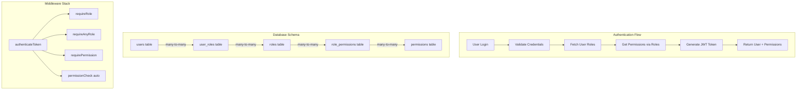
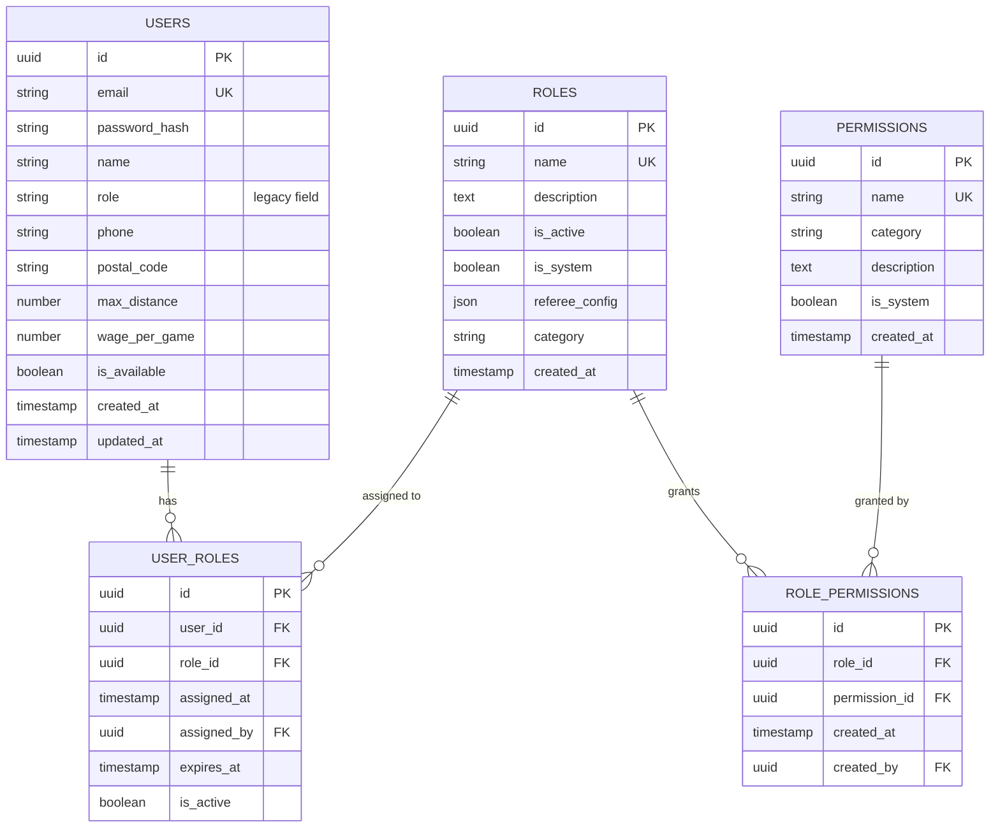
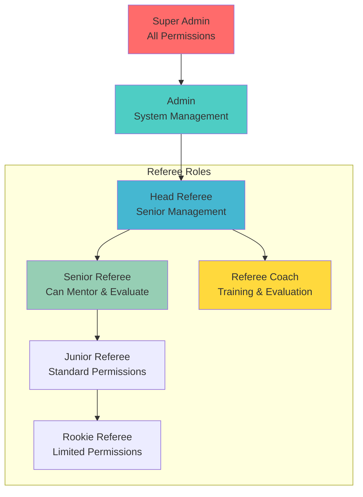
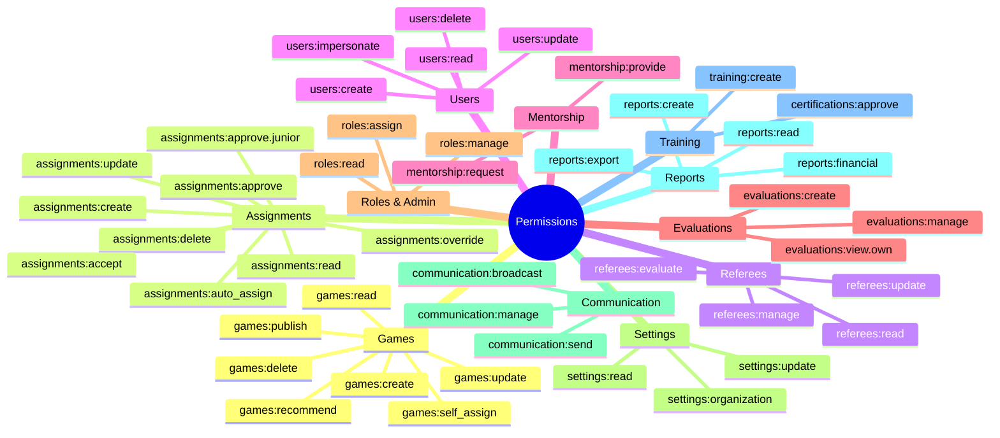
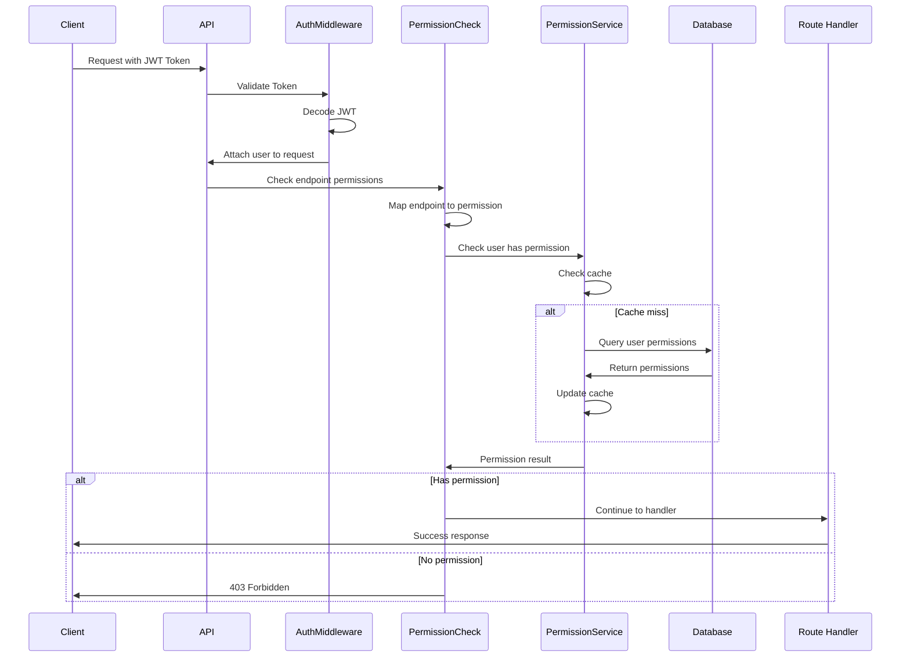
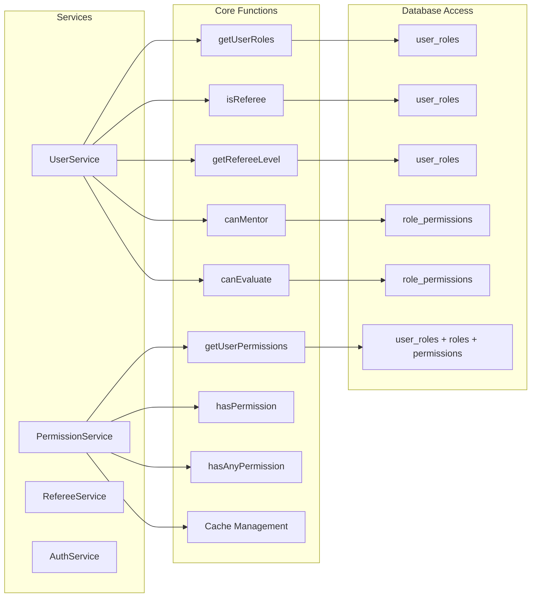
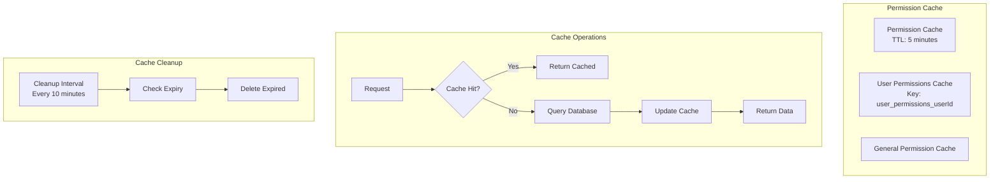
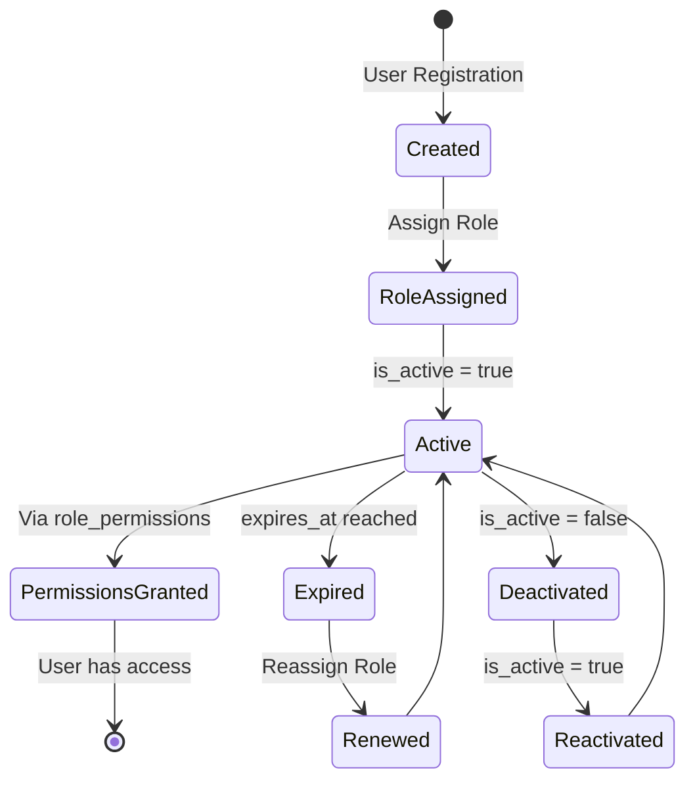

# Role and User System Architecture Diagram

## System Overview



## Database Entity Relationship



## Role Hierarchy



## Permission Categories & Examples



## API Authorization Flow



## Service Layer Architecture



## Caching Strategy



## Permission Mapping Example

```mermaid
graph LR
    subgraph "HTTP Request"
        M[Method: PUT]
        P[Path: /api/games/123]
    end

    subgraph "Normalization"
        N[Normalize Path]
        N --> NP[/api/games/:id]
    end

    subgraph "Permission Lookup"
        K[Key: PUT /api/games/:id]
        K --> PM[Permission: games:update]
    end

    subgraph "Authorization Check"
        PM --> UC{User has<br/>games:update?}
        UC -->|Yes| A[Allow]
        UC -->|No| D[Deny 403]
    end

    M --> N
    P --> N
    NP --> K
```

## Role Assignment Lifecycle



## Key Features

### 1. **Backward Compatibility**
- Legacy `role` field maintained in users table
- Supports both old (role string) and new (RBAC) systems
- Gradual migration path from simple to complex permissions

### 2. **Super Admin Bypass**
- Super Admin role automatically receives all permissions
- No need to explicitly assign permissions to Super Admin
- Checked first in permission service for efficiency

### 3. **Flexible Permission Assignment**
- Permissions can be grouped by category
- Roles can have multiple permissions
- Users can have multiple roles
- Temporal role assignments (with expiry)

### 4. **Performance Optimization**
- In-memory caching with 5-minute TTL
- Automatic cache cleanup every 10 minutes
- Efficient permission checking with early returns
- Indexed database queries for fast lookups

### 5. **Audit Trail**
- Role assignments tracked with assigned_by and assigned_at
- Permission changes logged
- Login attempts and successes recorded
- Critical security events monitored