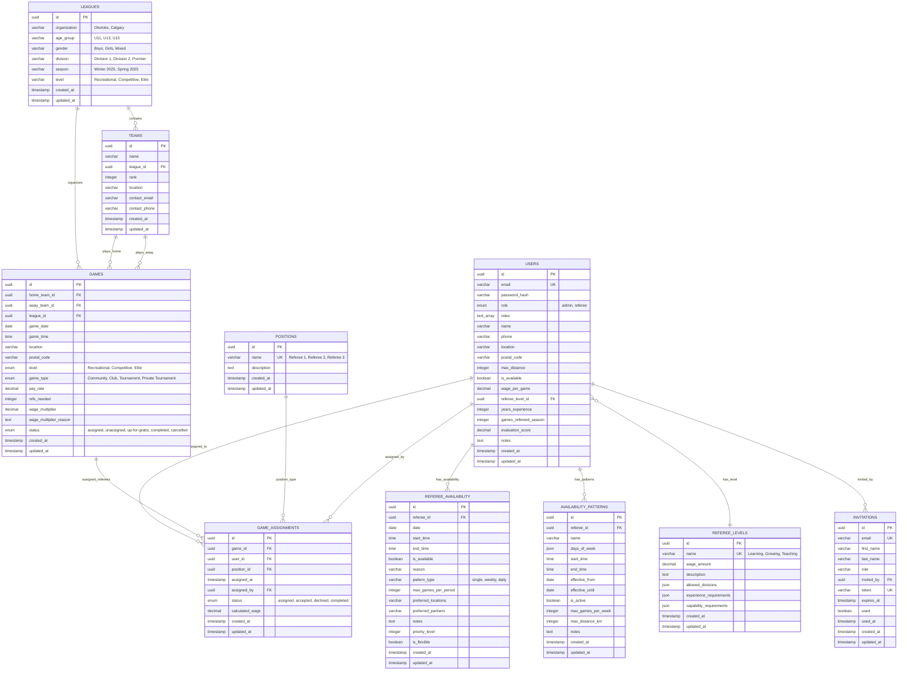

# Sports Management App - Database Schema Diagram

## Key Database Features

### 🔗 **Core Relationships**
- **Users**: Central entity handling both admins and referees
- **Games**: Connected to teams, leagues, and referee assignments
- **Teams**: Organized within leagues with proper normalization

### 📊 **Data Integrity**
- UUID primary keys throughout for better distribution
- Unique constraints on critical combinations
- Foreign key constraints with proper cascade rules
- Enum types for controlled vocabulary

### 🚀 **Performance Optimizations**
- Indexes on frequently queried fields (game_date, location, etc.)
- Normalized structure reducing data duplication
- Efficient many-to-many relationships through junction tables

### 🔄 **Recent Schema Evolution**
1. **Team/League Restructuring**: Migrated from JSON to proper entities
2. **User Consolidation**: Merged referees into users table
3. **Enhanced Roles**: Added array-based role system
4. **Availability Patterns**: Support for recurring availability rules
5. **Game Types**: Added Community, Club, Tournament classifications

### 💡 **Advanced Features**
- **Flexible Availability**: Both single dates and recurring patterns
- **Wage Calculation**: Automatic wage calculation with multipliers
- **Assignment Tracking**: Full lifecycle of referee assignments
- **Invitation System**: Secure user onboarding workflow

This schema supports comprehensive sports league management with proper data integrity, performance optimization, and flexibility for complex referee assignment workflows.