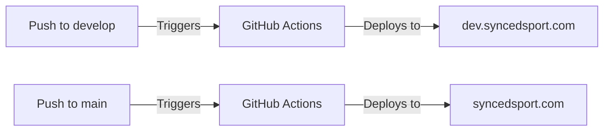

# Git Workflow & Deployment Guide

Complete guide to the SportsManager git workflow, branching strategy, and deployment process.

## Table of Contents

- [Branch Strategy](#branch-strategy)
- [Development Workflow](#development-workflow)
- [Pull Request Process](#pull-request-process)
- [Deployment Process](#deployment-process)
- [Environment Details](#environment-details)
- [Best Practices](#best-practices)

## Branch Strategy

### Branch Types

```
main (protected)
  ↑
  PR
  ↑
develop (development branch)
  ↑
  PR
  ↑
feature/* (feature branches)
```

### Branch Descriptions

| Branch | Purpose | Auto-Deploy To | Protection |
|--------|---------|----------------|------------|
| `main` | Production code | syncedsport.com | Yes - requires PR |
| `develop` | Development/staging | dev.syncedsport.com | No - direct push allowed |
| `feature/*` | New features | N/A (local only) | No |
| `fix/*` | Bug fixes | N/A (local only) | No |
| `hotfix/*` | Production hotfixes | N/A | No |

## Development Workflow

### Day-to-Day Development

```bash
# 1. Start with latest develop
git checkout develop
git pull origin develop

# 2. Create feature branch
git checkout -b feature/add-referee-ratings

# 3. Make changes and commit
git add .
git commit -m "feat: Add referee rating system"

# 4. Push to GitHub
git push origin feature/add-referee-ratings

# 5. Create Pull Request
# Go to GitHub: feature/add-referee-ratings → develop

# 6. After PR merge, cleanup
git checkout develop
git pull origin develop
git branch -d feature/add-referee-ratings
```

### Commit Message Format

Use conventional commits:

```bash
feat: Add new feature
fix: Fix a bug
docs: Documentation changes
style: Code style changes (formatting)
refactor: Code refactoring
test: Add or update tests
chore: Maintenance tasks
```

**Examples:**
```bash
git commit -m "feat: Add referee availability calendar"
git commit -m "fix: Correct game assignment validation"
git commit -m "docs: Update API documentation for games endpoint"
git commit -m "refactor: Simplify referee matching algorithm"
```

## Pull Request Process

### Creating a Pull Request

**Feature → Develop:**
```bash
# 1. Push your feature branch
git push origin feature/my-feature

# 2. Go to GitHub repository
# 3. Click "Pull requests" → "New pull request"
# 4. Base: develop ← Compare: feature/my-feature
# 5. Fill in PR template
# 6. Create pull request
```

**Develop → Main:**
```bash
# 1. Ensure develop is stable and tested
# 2. Go to GitHub repository
# 3. Click "Pull requests" → "New pull request"
# 4. Base: main ← Compare: develop
# 5. Fill in PR template with release notes
# 6. Request review (if required)
# 7. After approval, merge
```

### PR Template

```markdown
## Description
Brief description of changes

## Type of Change
- [ ] New feature
- [ ] Bug fix
- [ ] Breaking change
- [ ] Documentation update

## Testing
- [ ] Tested locally
- [ ] Tested on dev.syncedsport.com
- [ ] Database migrations tested (if applicable)

## Screenshots (if applicable)
Add screenshots of UI changes

## Checklist
- [ ] Code follows style guidelines
- [ ] Self-review completed
- [ ] Comments added to complex code
- [ ] Documentation updated
- [ ] No console errors or warnings
```

### Review Process

**For feature → develop:**
- Optional code review
- Self-review encouraged
- Can merge immediately if confident

**For develop → main:**
- Code review recommended
- Test on dev.syncedsport.com first
- Ensure no breaking changes
- Review deployment checklist

## Deployment Process

### Automatic Deployments

Both environments deploy automatically via GitHub Actions:



### Development Deployment (develop → dev.syncedsport.com)

**What happens on push to develop:**

1. **Pre-deployment**
   - GitHub Actions detects push to develop
   - Runner on CT101 starts deployment job

2. **Deployment Steps**
   - SSH to CT102 (production server)
   - Pull latest code from develop branch
   - Check for database migrations
   - Run migrations if detected
   - Rebuild Docker containers
   - Wait for health checks

3. **Health Checks**
   - Backend health: http://localhost:3002/health
   - Frontend health: http://localhost:3005
   - External check: https://dev.syncedsport.com

4. **Verification**
   - Display container status
   - Show deployment summary
   - Send success notification

**View deployment:**
```bash
# Check GitHub Actions
https://github.com/fisherjoey/SportsManager/actions

# Or check runner logs:
ssh -i ~/.ssh/id_rsa root@10.0.0.5 \
  'pct exec 101 -- journalctl -u actions.runner.fisherjoey-SportsManager.ct101-sports-runner -f'
```

### Production Deployment (main → syncedsport.com)

**What happens on push to main:**

1. **Pre-deployment Checks**
   - Check for migrations
   - Check for Docker changes
   - Validate deployment should proceed

2. **Deployment Steps**
   - Create database backup
   - Pull latest code from main branch
   - Run database migrations (if any)
   - Rebuild Docker containers
   - Wait for services to stabilize

3. **Health Checks**
   - Internal backend health
   - Internal frontend health
   - External via Cloudflare Tunnel
   - API endpoint verification

4. **Post-Deployment**
   - Display deployment summary
   - Show container status
   - Log deployment success

5. **Rollback on Failure**
   - Displays error logs
   - Manual rollback available if needed

### Manual Deployment

**Deploy development manually:**
```bash
# Trigger via GitHub Actions UI
# Go to: Actions → Deploy to Development → Run workflow
```

**Deploy production manually:**
```bash
# Trigger via GitHub Actions UI
# Go to: Actions → Deploy to Production → Run workflow
```

## Environment Details

### Production (syncedsport.com)

| Component | Details |
|-----------|---------|
| **Server** | CT102 on Proxmox |
| **Backend** | Port 3001, Docker container |
| **Frontend** | Port 3004, Docker container |
| **Database** | sports_management |
| **URL** | https://syncedsport.com |
| **Branch** | main |

### Development (dev.syncedsport.com)

| Component | Details |
|-----------|---------|
| **Server** | CT102 on Proxmox (same as prod) |
| **Backend** | Port 3002, Docker container |
| **Frontend** | Port 3005, Docker container |
| **Database** | sports_management_dev |
| **URL** | https://dev.syncedsport.com |
| **Branch** | develop |
| **Auth Bypass** | Enabled (DISABLE_AUTH: true) |

### Local Development

| Component | Details |
|-----------|---------|
| **Server** | Your machine |
| **Backend** | Port 3001, Docker container |
| **Frontend** | Port 3000, Docker container |
| **Database** | sports_management (local) |
| **URL** | http://localhost:3000 |
| **Branch** | Any (usually feature/*) |

## Best Practices

### Before Starting Work

```bash
# Always start with latest develop
git checkout develop
git pull origin develop

# Create feature branch
git checkout -b feature/descriptive-name
```

### During Development

- **Commit often:** Small, focused commits
- **Test locally:** Use docker-compose.local.yml
- **Run migrations:** Test both up and down
- **Check logs:** Ensure no errors in console
- **Update docs:** If changing APIs or features

### Before Creating PR

```bash
# Pull latest develop
git checkout develop
git pull origin develop

# Merge into your feature
git checkout feature/your-feature
git merge develop

# Resolve conflicts if any
# Test locally again
# Push to GitHub
git push origin feature/your-feature
```

### Before Merging to Main

- [ ] Tested on dev.syncedsport.com
- [ ] No errors in dev environment
- [ ] Database migrations tested
- [ ] Breaking changes documented
- [ ] Team notified of deployment

### After Deployment

```bash
# Verify deployment succeeded
# Check GitHub Actions for green checkmark

# Test the deployed environment
curl https://dev.syncedsport.com  # for develop
curl https://syncedsport.com      # for main

# Pull latest to your local
git checkout develop
git pull origin develop
```

## Emergency Procedures

### Hotfix Process

For critical production bugs:

```bash
# 1. Create hotfix from main
git checkout main
git pull origin main
git checkout -b hotfix/critical-bug

# 2. Fix the issue
# Make minimal changes

# 3. Test locally
docker-compose -f docker-compose.local.yml up

# 4. Create PR to main
git push origin hotfix/critical-bug
# Create PR: hotfix/critical-bug → main

# 5. After merge, backport to develop
git checkout develop
git pull origin develop
git merge main
git push origin develop
```

### Rollback Production

If production deployment fails:

```bash
# Option 1: Revert the commit
git checkout main
git revert HEAD
git push origin main
# Triggers new deployment with reverted changes

# Option 2: Manual rollback on server
ssh -i ~/.ssh/id_rsa root@10.0.0.5
pct exec 102 -- bash
cd /root/SportsManager
git checkout HEAD~1  # Go back one commit
cd deployment
docker compose -f docker-compose.deploy.yml up -d --build
```

## Monitoring Deployments

### View Deployment Logs

```bash
# GitHub Actions
https://github.com/fisherjoey/SportsManager/actions

# CT101 Runner logs
ssh -i ~/.ssh/id_rsa root@10.0.0.5 \
  'pct exec 101 -- journalctl -u actions.runner.fisherjoey-SportsManager.ct101-sports-runner --since "1 hour ago"'

# CT102 Container logs
ssh -i ~/.ssh/id_rsa root@10.0.0.5 \
  'pct exec 102 -- docker logs sportsmanager-backend -f'
```

### Health Check URLs

**Production:**
- Backend: https://syncedsport.com/api/health
- Frontend: https://syncedsport.com

**Development:**
- Backend: https://dev.syncedsport.com/api/health
- Frontend: https://dev.syncedsport.com

## Additional Resources

- [DEVELOPER_SETUP.md](./DEVELOPER_SETUP.md) - Quick start guide
- [LOCAL_DEVELOPMENT.md](./LOCAL_DEVELOPMENT.md) - Detailed local dev guide
- [GitHub Flow Guide](https://guides.github.com/introduction/flow/)
- [Conventional Commits](https://www.conventionalcommits.org/)
