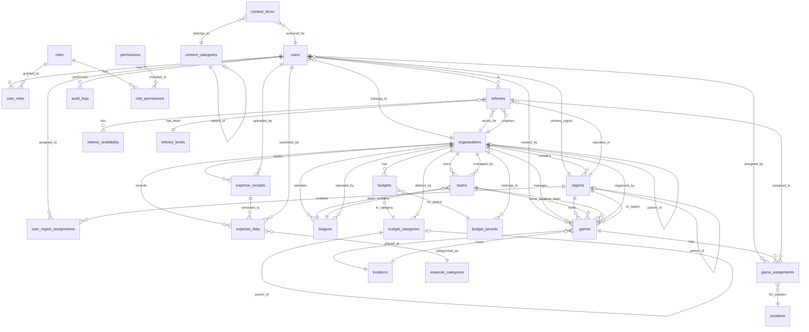

# Sports Manager Database Schema Diagram
**Generated Date:** September 28, 2025
**Version:** 1.0
**Database:** PostgreSQL

## Database Entity Relationship Diagram

## Table Definitions

### Core Tables

#### **users**
| Column | Type | Constraints | Description |
|--------|------|------------|-------------|
| id | UUID | PRIMARY KEY | Auto-generated unique identifier |
| email | VARCHAR | UNIQUE, NOT NULL | User's email address |
| password_hash | VARCHAR | NOT NULL | Encrypted password |
| role | ENUM | | 'admin', 'referee', 'assignor', 'manager' |
| name | VARCHAR | | User's full name |
| phone | VARCHAR(20) | | Contact phone number |
| postal_code | VARCHAR(10) | | Postal/ZIP code |
| max_distance | INTEGER | DEFAULT 25 | Maximum travel distance (km) |
| is_available | BOOLEAN | DEFAULT true | Availability status |
| white_whistle | BOOLEAN | DEFAULT false | Elite referee certification |
| availability_strategy | ENUM | | 'WHITELIST' or 'BLACKLIST' |
| wage_per_game | DECIMAL | | Standard game payment rate |
| organization_id | UUID | FK → organizations.id | Parent organization |
| primary_region_id | UUID | FK → regions.id | Primary operating region |
| created_at | TIMESTAMP | DEFAULT NOW() | Record creation timestamp |
| updated_at | TIMESTAMP | | Last modification timestamp |

#### **referees**
| Column | Type | Constraints | Description |
|--------|------|------------|-------------|
| id | UUID | PRIMARY KEY | Unique identifier |
| user_id | UUID | FK → users.id | Associated user account |
| name | VARCHAR | NOT NULL | Referee's full name |
| email | VARCHAR | UNIQUE, NOT NULL | Contact email |
| phone | VARCHAR(20) | | Contact phone |
| level | ENUM | | 'Recreational', 'Competitive', 'Elite' |
| location | VARCHAR | | Primary location |
| postal_code | VARCHAR(10) | NOT NULL | Postal/ZIP code |
| max_distance | INTEGER | DEFAULT 25 | Maximum travel distance |
| is_available | BOOLEAN | DEFAULT true | Current availability |
| organization_id | UUID | FK → organizations.id | Employing organization |
| primary_region_id | UUID | FK → regions.id | Primary region |
| created_at | TIMESTAMP | | Creation timestamp |
| updated_at | TIMESTAMP | | Last update timestamp |

#### **games**
| Column | Type | Constraints | Description |
|--------|------|------------|-------------|
| id | UUID | PRIMARY KEY | Unique identifier |
| home_team_id | UUID | FK → teams.id | Home team reference |
| away_team_id | UUID | FK → teams.id | Away team reference |
| home_team_name | VARCHAR | NOT NULL | Home team name |
| away_team_name | VARCHAR | NOT NULL | Away team name |
| game_date | DATE | NOT NULL | Game date |
| game_time | TIME | NOT NULL | Game start time |
| location | VARCHAR | NOT NULL | Venue name |
| location_id | UUID | FK → locations.id | Venue reference |
| postal_code | VARCHAR(10) | NOT NULL | Venue postal code |
| level | ENUM | NOT NULL | 'Recreational', 'Competitive', 'Elite' |
| game_type | ENUM | | 'Community', 'Club', 'Tournament', 'Private Tournament' |
| division | VARCHAR | | Age/skill division |
| season | VARCHAR | | Season identifier |
| pay_rate | DECIMAL(10,2) | NOT NULL | Base referee payment |
| refs_needed | INTEGER | DEFAULT 2 | Number of referees required |
| wage_multiplier | DECIMAL | DEFAULT 1.0 | Payment adjustment factor |
| wage_multiplier_reason | VARCHAR | | Reason for adjustment |
| status | ENUM | DEFAULT 'unassigned' | 'assigned', 'unassigned', 'up-for-grabs', 'completed', 'cancelled' |
| organization_id | UUID | FK → organizations.id | Organizing body |
| region_id | UUID | FK → regions.id | Game region |
| created_by | UUID | FK → users.id | Creating user |
| external_id | VARCHAR | | External system ID |
| created_at | TIMESTAMP | | Creation timestamp |
| updated_at | TIMESTAMP | | Last update timestamp |

#### **game_assignments (assignments)**
| Column | Type | Constraints | Description |
|--------|------|------------|-------------|
| id | UUID | PRIMARY KEY | Unique identifier |
| game_id | UUID | FK → games.id CASCADE DELETE | Associated game |
| referee_id | UUID | FK → referees.id CASCADE DELETE | Assigned referee |
| position_id | UUID | FK → positions.id | Referee position |
| assigned_by | UUID | FK → users.id | Assigning user |
| assigned_at | TIMESTAMP | DEFAULT NOW() | Assignment timestamp |
| status | ENUM | DEFAULT 'assigned' | 'assigned', 'accepted', 'declined', 'completed' |
| calculated_wage | DECIMAL | | Final payment amount |
| organization_id | UUID | FK → organizations.id | Organization context |
| created_at | TIMESTAMP | | Creation timestamp |
| updated_at | TIMESTAMP | | Last update timestamp |

### Organization & Multi-tenancy

#### **organizations**
| Column | Type | Constraints | Description |
|--------|------|------------|-------------|
| id | UUID | PRIMARY KEY | Unique identifier |
| name | VARCHAR(255) | NOT NULL | Organization name |
| slug | VARCHAR(100) | UNIQUE, NOT NULL | URL-friendly identifier |
| parent_organization_id | UUID | FK → organizations.id | Parent org for hierarchy |
| settings | JSONB | DEFAULT '{}' | Configuration settings |
| created_at | TIMESTAMP | | Creation timestamp |
| updated_at | TIMESTAMP | | Last update timestamp |

#### **regions**
| Column | Type | Constraints | Description |
|--------|------|------------|-------------|
| id | UUID | PRIMARY KEY | Unique identifier |
| organization_id | UUID | FK → organizations.id CASCADE DELETE | Parent organization |
| parent_region_id | UUID | FK → regions.id SET NULL | Parent region for hierarchy |
| name | VARCHAR(255) | NOT NULL | Region name |
| slug | VARCHAR(100) | NOT NULL | URL-friendly identifier |
| settings | JSONB | DEFAULT '{}' | Regional settings |
| created_at | TIMESTAMP | | Creation timestamp |
| updated_at | TIMESTAMP | | Last update timestamp |

### RBAC System

#### **roles**
| Column | Type | Constraints | Description |
|--------|------|------------|-------------|
| id | UUID | PRIMARY KEY | Unique identifier |
| name | VARCHAR(100) | UNIQUE, NOT NULL | Role name |
| code | VARCHAR(100) | UNIQUE | Internal role code |
| description | TEXT | | Role description |
| is_active | BOOLEAN | DEFAULT true, NOT NULL | Active status |
| is_system | BOOLEAN | DEFAULT false, NOT NULL | System role flag |
| color | VARCHAR | | UI color coding |
| created_at | TIMESTAMP | | Creation timestamp |
| updated_at | TIMESTAMP | | Last update timestamp |

#### **permissions**
| Column | Type | Constraints | Description |
|--------|------|------------|-------------|
| id | UUID | PRIMARY KEY | Unique identifier |
| name | VARCHAR(100) | UNIQUE, NOT NULL | Permission name |
| category | VARCHAR(50) | NOT NULL | Permission category |
| description | TEXT | | Permission description |
| is_system | BOOLEAN | DEFAULT false, NOT NULL | System permission flag |
| created_at | TIMESTAMP | | Creation timestamp |
| updated_at | TIMESTAMP | | Last update timestamp |

#### **user_roles**
| Column | Type | Constraints | Description |
|--------|------|------------|-------------|
| id | UUID | PRIMARY KEY | Unique identifier |
| user_id | UUID | FK → users.id CASCADE DELETE | User reference |
| role_id | UUID | FK → roles.id CASCADE DELETE | Role reference |
| assigned_by | UUID | FK → users.id SET NULL | Assigning user |
| assigned_at | TIMESTAMP | DEFAULT NOW() | Assignment timestamp |
| expires_at | TIMESTAMP | | Optional expiration |
| is_active | BOOLEAN | DEFAULT true, NOT NULL | Active status |

### Financial Management

#### **budgets**
| Column | Type | Constraints | Description |
|--------|------|------------|-------------|
| id | UUID | PRIMARY KEY | Unique identifier |
| organization_id | UUID | FK → organizations.id | Organization |
| budget_period_id | UUID | FK → budget_periods.id CASCADE DELETE | Budget period |
| category_id | UUID | FK → budget_categories.id CASCADE DELETE | Budget category |
| owner_id | UUID | FK → users.id SET NULL | Budget owner |
| name | VARCHAR | NOT NULL | Budget name |
| description | TEXT | | Budget description |
| allocated_amount | DECIMAL(12,2) | DEFAULT 0 | Total allocated |
| committed_amount | DECIMAL(12,2) | DEFAULT 0 | Committed funds |
| actual_spent | DECIMAL(12,2) | DEFAULT 0 | Actual expenditure |
| reserved_amount | DECIMAL(12,2) | DEFAULT 0 | Reserved funds |
| available_amount | DECIMAL(12,2) | DEFAULT 0 | Available balance |
| status | ENUM | DEFAULT 'draft' | 'draft', 'approved', 'active', 'locked', 'closed' |
| variance_rules | JSON | | Variance thresholds |
| seasonal_patterns | JSON | | Seasonal adjustments |
| created_at | TIMESTAMP | | Creation timestamp |
| updated_at | TIMESTAMP | | Last update timestamp |

### Expense Management

#### **expense_receipts**
| Column | Type | Constraints | Description |
|--------|------|------------|-------------|
| id | UUID | PRIMARY KEY | Unique identifier |
| user_id | UUID | FK → users.id CASCADE DELETE | Uploading user |
| organization_id | UUID | FK → organizations.id | Organization |
| original_filename | VARCHAR | NOT NULL | Original file name |
| file_path | VARCHAR | NOT NULL | Storage path |
| file_type | VARCHAR | NOT NULL | File extension |
| mime_type | VARCHAR | NOT NULL | MIME type |
| file_size | INTEGER | NOT NULL | File size in bytes |
| file_hash | VARCHAR | NOT NULL | File hash for deduplication |
| processing_status | ENUM | DEFAULT 'uploaded' | 'uploaded', 'processing', 'processed', 'failed', 'manual_review' |
| processing_notes | TEXT | | Processing notes |
| raw_ocr_text | TEXT | | OCR extracted text |
| ai_confidence_scores | JSON | | AI confidence metrics |
| processing_metadata | JSON | | Processing metadata |
| uploaded_at | TIMESTAMP | DEFAULT NOW() | Upload timestamp |
| processed_at | TIMESTAMP | | Processing timestamp |
| created_at | TIMESTAMP | | Creation timestamp |
| updated_at | TIMESTAMP | | Last update timestamp |

#### **expense_data**
| Column | Type | Constraints | Description |
|--------|------|------------|-------------|
| id | UUID | PRIMARY KEY | Unique identifier |
| receipt_id | UUID | FK → expense_receipts.id CASCADE DELETE | Source receipt |
| user_id | UUID | FK → users.id CASCADE DELETE | Submitting user |
| organization_id | UUID | FK → organizations.id | Organization |
| category_id | UUID | FK → expense_categories.id SET NULL | Expense category |
| vendor_name | VARCHAR | | Vendor/merchant name |
| vendor_address | TEXT | | Vendor address |
| vendor_phone | VARCHAR | | Vendor phone |
| total_amount | DECIMAL(10,2) | | Total amount |
| tax_amount | DECIMAL(10,2) | | Tax amount |
| subtotal_amount | DECIMAL(10,2) | | Subtotal |
| transaction_date | DATE | | Transaction date |
| transaction_time | VARCHAR | | Transaction time |
| receipt_number | VARCHAR | | Receipt number |
| payment_method | VARCHAR | | Payment method |
| category_name | VARCHAR | | Category name (denormalized) |
| description | TEXT | | Expense description |
| line_items | JSON | | Itemized details |
| business_purpose | VARCHAR | | Business justification |
| project_code | VARCHAR | | Project code |
| department | VARCHAR | | Department |
| reimbursable | BOOLEAN | DEFAULT true | Reimbursable flag |
| ai_extracted_fields | JSON | | AI-extracted data |
| extraction_confidence | DECIMAL(3,2) | | Extraction confidence |
| field_confidence_scores | JSON | | Per-field confidence |
| requires_manual_review | BOOLEAN | DEFAULT false | Manual review flag |
| manually_corrected | BOOLEAN | DEFAULT false | Correction flag |
| corrections_made | JSON | | Correction details |
| corrected_by | UUID | FK → users.id SET NULL | Correcting user |
| corrected_at | TIMESTAMP | | Correction timestamp |
| extracted_at | TIMESTAMP | DEFAULT NOW() | Extraction timestamp |
| created_at | TIMESTAMP | | Creation timestamp |
| updated_at | TIMESTAMP | | Last update timestamp |

## Database Indexes

### Performance Indexes
- **users**: email, organization_id, primary_region_id
- **referees**: level, postal_code, is_available, organization_id
- **games**: game_date, status, level, postal_code, organization_id, region_id
- **game_assignments**: game_id, referee_id, status
- **referee_availability**: (referee_id, date), (date, start_time, end_time)
- **organizations**: slug
- **regions**: organization_id, parent_region_id, (organization_id, slug)
- **roles**: is_active, name
- **permissions**: category, name
- **budgets**: (organization_id, status), (budget_period_id, category_id)
- **expense_receipts**: (user_id, processing_status), file_hash
- **expense_data**: (user_id, transaction_date), (organization_id, category_id)

## Constraints

### Unique Constraints
- **users**: email
- **organizations**: slug
- **regions**: (organization_id, slug)
- **game_assignments**: (game_id, position_id), (game_id, referee_id)
- **roles**: name, code
- **permissions**: name
- **role_permissions**: (role_id, permission_id)
- **user_roles**: (user_id, role_id)
- **leagues**: (organization, age_group, gender, division, season)

### Check Constraints
- **organizations**: parent_organization_id != id (no self-reference)
- **content_items**: status IN ('draft', 'published', 'archived', 'deleted')
- **content_items**: visibility IN ('public', 'private', 'restricted')
- **games**: level IN ('Recreational', 'Competitive', 'Elite')
- **budgets**: status IN ('draft', 'approved', 'active', 'locked', 'closed')

## Database Features

### 1. **Multi-tenancy Architecture**
- Organization-based data isolation
- Hierarchical organization support
- Regional subdivision within organizations

### 2. **Advanced RBAC**
- Fine-grained permissions
- Role inheritance support
- Time-based role assignments
- System vs custom roles

### 3. **Financial Management**
- Complete budget lifecycle
- Expense tracking with AI/OCR
- Multi-level approvals
- Category-based allocation

### 4. **Audit & Compliance**
- Comprehensive audit logging
- Data change tracking
- User action monitoring
- Compliance reporting support

### 5. **Performance Optimization**
- Strategic indexing
- JSONB for flexible data
- Materialized views for reports
- Partitioning for large tables

### 6. **Data Integrity**
- Foreign key constraints
- Check constraints
- Unique constraints
- Cascade delete rules

## Migration History
- **Initial Schema**: Base tables for users, games, teams
- **RBAC Addition**: Roles, permissions, user_roles
- **Multi-tenancy**: Organizations, regions, assignments
- **Financial Module**: Budgets, expenses, receipts
- **AI Integration**: OCR processing, AI extraction
- **Content Management**: Rich content, categories
- **Performance Updates**: Additional indexes, optimizations

## Backup & Recovery Strategy
- **Daily Backups**: Full database backup at 2 AM
- **Point-in-Time Recovery**: WAL archiving enabled
- **Retention Policy**: 30 days of daily backups
- **Disaster Recovery**: Geo-replicated backups

## Database Statistics
- **Total Tables**: 26 primary tables
- **Total Indexes**: 50+ performance indexes
- **Average Row Count**: Varies by table (users: ~1000, games: ~10000)
- **Database Size**: Approximately 500 MB (as of January 2025)

---
*Document Last Updated: January 28, 2025*
*Database Version: PostgreSQL 15.x*
*Schema Version: 1.0.0*