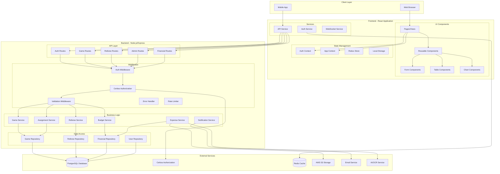
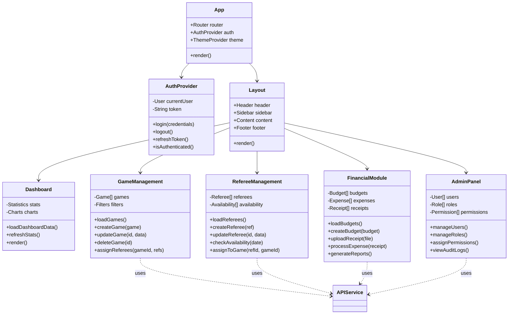
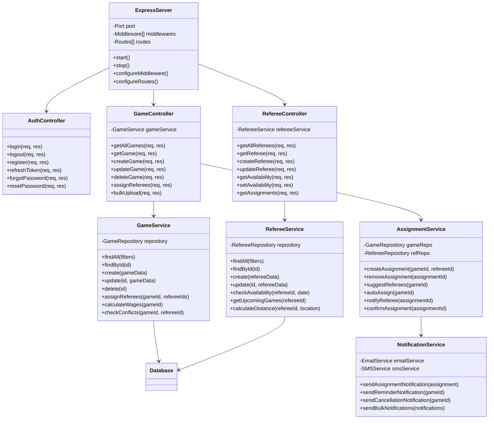
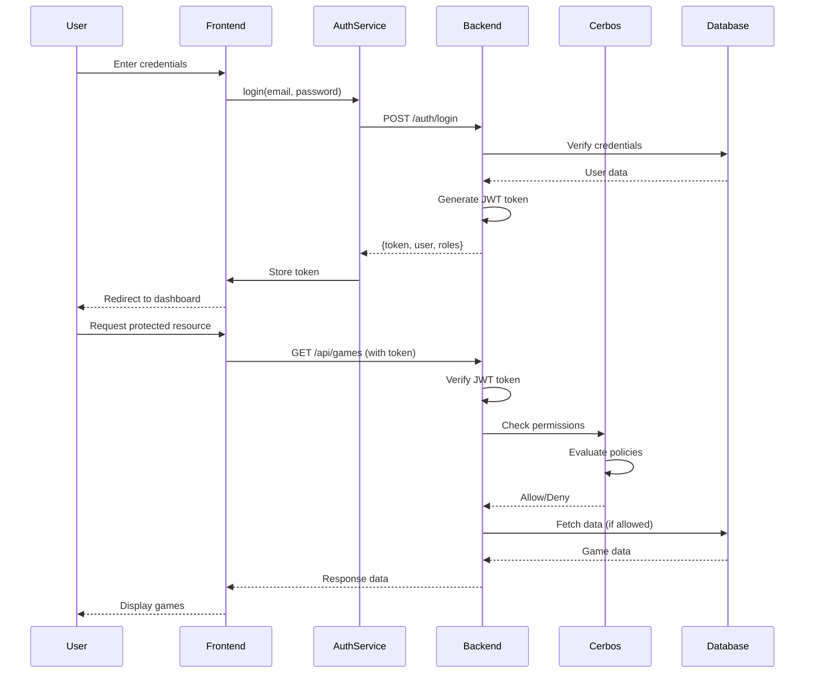
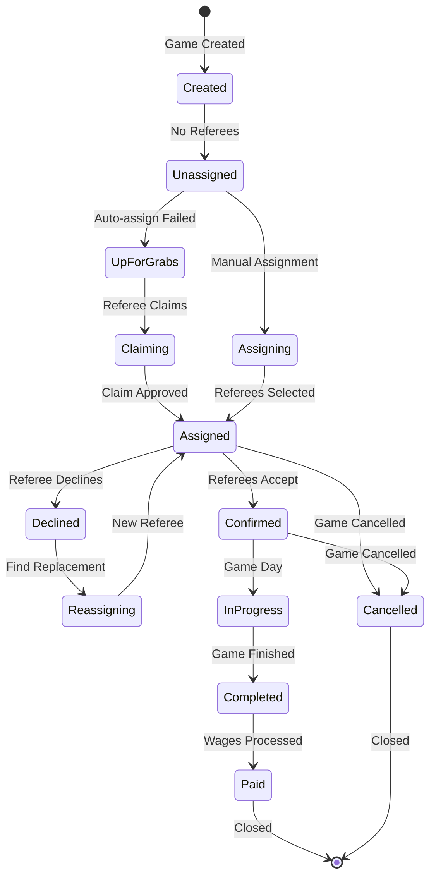
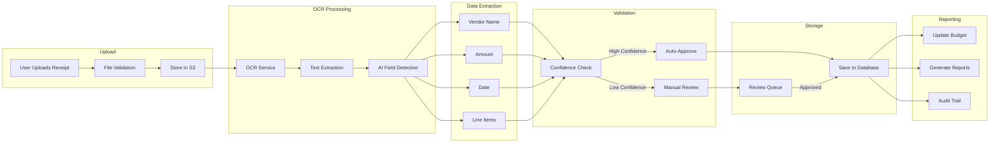
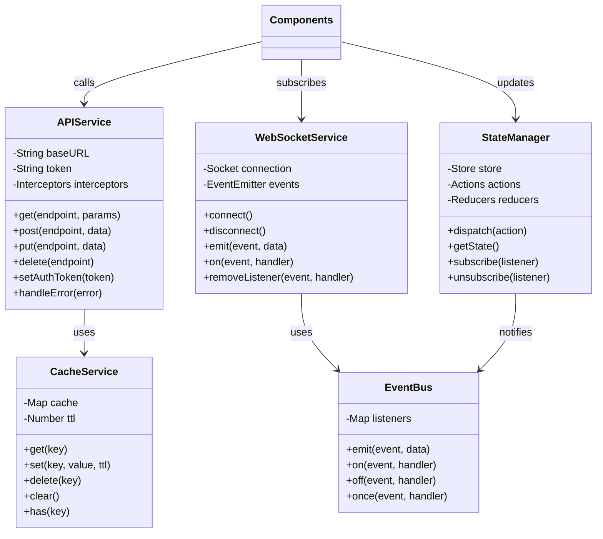
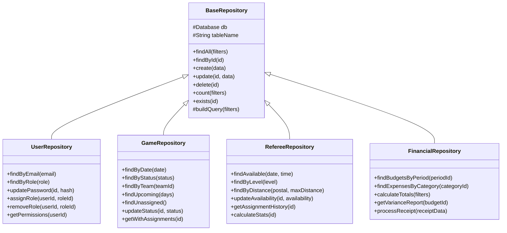
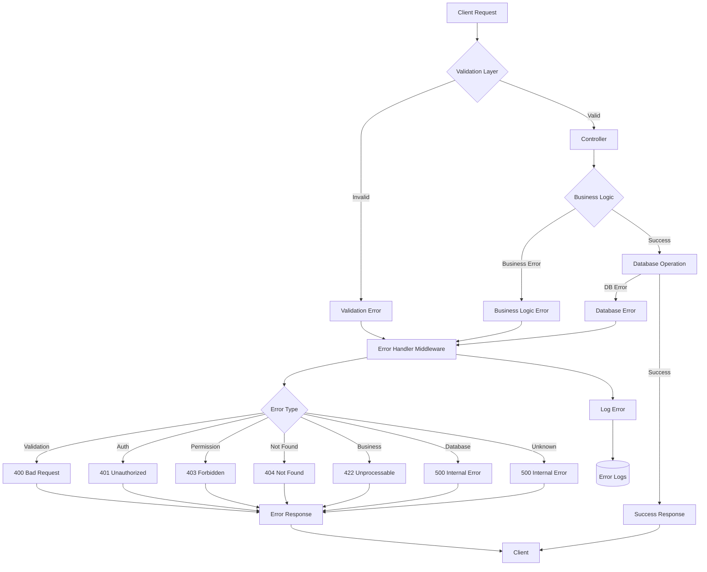
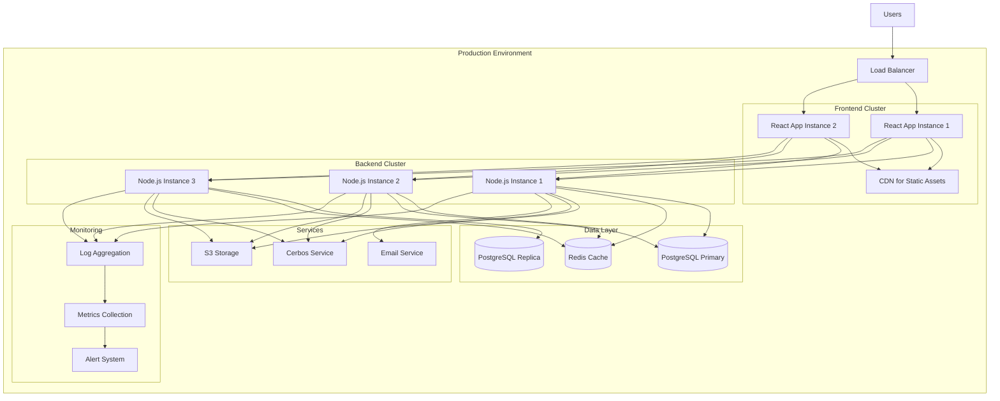

# Sports Manager UML Architecture Diagram
**Generated Date:** September 28, 2025
**Version:** 1.0
**System:** Sports Manager Application (Frontend + Backend)

## System Overview UML Diagram

## Frontend Component Architecture

## Backend Service Architecture

## Authentication & Authorization Flow

## Game Assignment Workflow

## Expense Processing Pipeline

## Component Communication Patterns

## Database Repository Pattern

## Error Handling Architecture

## Deployment Architecture

## Key Design Patterns Used

### 1. **Frontend Patterns**
- **Component Composition**: Building complex UIs from simple components
- **Container/Presenter**: Separating logic from presentation
- **Higher-Order Components**: Adding functionality to components
- **Custom Hooks**: Reusing stateful logic
- **Context API**: Managing global state
- **Render Props**: Sharing code between components

### 2. **Backend Patterns**
- **MVC Architecture**: Model-View-Controller separation
- **Repository Pattern**: Abstracting data access
- **Service Layer**: Business logic encapsulation
- **Middleware Chain**: Request processing pipeline
- **Dependency Injection**: Loose coupling
- **Factory Pattern**: Object creation
- **Strategy Pattern**: Algorithm selection
- **Observer Pattern**: Event-driven architecture

### 3. **Database Patterns**
- **Active Record**: ORM pattern
- **Data Mapper**: Separating domain from persistence
- **Unit of Work**: Transaction management
- **Query Builder**: Dynamic SQL generation
- **Migration Pattern**: Schema versioning

### 4. **Security Patterns**
- **JWT Authentication**: Stateless auth
- **RBAC**: Role-based access control
- **Policy-based Authorization**: Cerbos integration
- **Input Validation**: Request sanitization
- **Rate Limiting**: API protection
- **CORS Configuration**: Cross-origin security

## API Endpoint Structure

### Authentication Endpoints
- `POST /auth/login` - User login
- `POST /auth/logout` - User logout
- `POST /auth/register` - New user registration
- `POST /auth/refresh` - Refresh JWT token
- `POST /auth/forgot-password` - Password reset request
- `POST /auth/reset-password` - Complete password reset

### Game Management Endpoints
- `GET /api/games` - List all games
- `GET /api/games/:id` - Get game details
- `POST /api/games` - Create new game
- `PUT /api/games/:id` - Update game
- `DELETE /api/games/:id` - Delete game
- `POST /api/games/:id/assign` - Assign referees
- `POST /api/games/bulk` - Bulk upload games
- `GET /api/games/upcoming` - Get upcoming games
- `GET /api/games/unassigned` - Get unassigned games

### Referee Management Endpoints
- `GET /api/referees` - List all referees
- `GET /api/referees/:id` - Get referee details
- `POST /api/referees` - Create new referee
- `PUT /api/referees/:id` - Update referee
- `DELETE /api/referees/:id` - Delete referee
- `GET /api/referees/:id/availability` - Get availability
- `POST /api/referees/:id/availability` - Set availability
- `GET /api/referees/:id/assignments` - Get assignments
- `GET /api/referees/available` - Find available referees

### Financial Management Endpoints
- `GET /api/budgets` - List budgets
- `POST /api/budgets` - Create budget
- `PUT /api/budgets/:id` - Update budget
- `GET /api/expenses` - List expenses
- `POST /api/expenses` - Create expense
- `POST /api/receipts/upload` - Upload receipt
- `GET /api/receipts/:id/process` - Process receipt
- `GET /api/reports/financial` - Generate reports

### Admin Endpoints
- `GET /api/admin/users` - List users
- `POST /api/admin/users` - Create user
- `PUT /api/admin/users/:id` - Update user
- `DELETE /api/admin/users/:id` - Delete user
- `GET /api/admin/roles` - List roles
- `POST /api/admin/roles` - Create role
- `PUT /api/admin/roles/:id` - Update role
- `POST /api/admin/roles/:id/permissions` - Assign permissions
- `GET /api/admin/audit-logs` - View audit logs

## Technology Stack

### Frontend
- **React 18.x**: UI framework
- **TypeScript**: Type safety
- **Redux Toolkit**: State management
- **React Router**: Navigation
- **Material-UI**: Component library
- **Axios**: HTTP client
- **Socket.io Client**: Real-time updates
- **Chart.js**: Data visualization
- **Formik**: Form handling
- **Yup**: Validation

### Backend
- **Node.js 18.x**: Runtime
- **Express 4.x**: Web framework
- **TypeScript**: Type safety
- **PostgreSQL 15.x**: Database
- **Prisma**: ORM
- **Redis**: Caching
- **JWT**: Authentication
- **Cerbos**: Authorization
- **Multer**: File uploads
- **Socket.io**: WebSockets
- **Bull**: Job queues
- **Winston**: Logging

### DevOps & Tools
- **Docker**: Containerization
- **Docker Compose**: Local development
- **GitHub Actions**: CI/CD
- **ESLint**: Code linting
- **Prettier**: Code formatting
- **Jest**: Testing
- **Supertest**: API testing
- **Cypress**: E2E testing

## Performance Optimizations

1. **Frontend Optimizations**
   - Code splitting and lazy loading
   - React.memo for component optimization
   - Virtual scrolling for large lists
   - Image lazy loading
   - Service Worker caching
   - Bundle size optimization

2. **Backend Optimizations**
   - Database query optimization
   - Redis caching strategy
   - Connection pooling
   - Async/await patterns
   - Rate limiting
   - Response compression

3. **Database Optimizations**
   - Strategic indexing
   - Query optimization
   - Materialized views
   - Partitioning for large tables
   - Connection pooling
   - Read replicas

## Security Measures

1. **Authentication & Authorization**
   - JWT with refresh tokens
   - Cerbos policy-based access
   - Role-based permissions
   - Session management
   - Password hashing (bcrypt)

2. **Data Protection**
   - Input validation
   - SQL injection prevention
   - XSS protection
   - CSRF tokens
   - Rate limiting
   - HTTPS enforcement

3. **Monitoring & Auditing**
   - Comprehensive audit logs
   - Error tracking
   - Performance monitoring
   - Security alerts
   - Compliance reporting

---
*Document Last Updated: January 28, 2025*
*Application Version: 1.0.0*
*Architecture Version: 1.0*