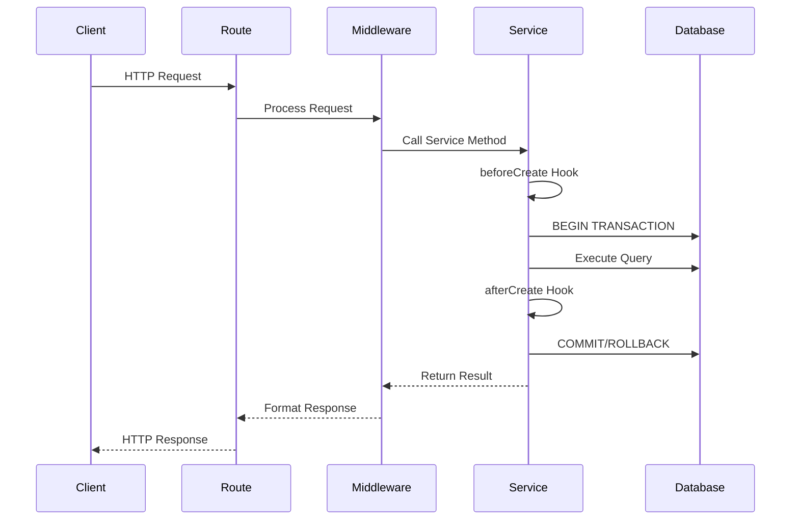

# Sports Manager Backend UML Class Diagram

## Class Diagram

```mermaid
classDiagram
    %% Base Classes and Interfaces
    class BaseEntity {
        <<interface>>
        +id: string
        +created_at: Date
        +updated_at: Date
    }

    class BaseService~T extends BaseEntity~ {
        <<abstract>>
        #db: Knex
        #tableName: string
        #selectableFields: string[]
        +findById(id: string, options?: QueryOptions): Promise~T~
        +findOne(filters: object, options?: QueryOptions): Promise~T~
        +findAll(filters: object, options?: QueryOptions): Promise~T[]~
        +create(data: Partial~T~, options?: QueryOptions): Promise~T~
        +update(id: string, data: Partial~T~, options?: QueryOptions): Promise~T~
        +delete(id: string, options?: QueryOptions): Promise~boolean~
        +findWithPagination(filters: object, page: number, limit: number, options?: QueryOptions): Promise~PaginatedResult~T~~
        +bulkCreate(records: Partial~T~[], options?: QueryOptions): Promise~T[]~
        +bulkUpdate(updates: BulkUpdate~T~[], options?: QueryOptions): Promise~number~
        +bulkDelete(ids: string[], options?: QueryOptions): Promise~number~
        +withTransaction(callback: Function): Promise~any~
        #beforeCreate(data: Partial~T~, trx?: Transaction): Promise~Partial~T~~
        #afterCreate(record: T, trx?: Transaction): Promise~void~
        #beforeUpdate(id: string, data: Partial~T~, trx?: Transaction): Promise~Partial~T~~
        #afterUpdate(record: T, trx?: Transaction): Promise~void~
        #beforeDelete(id: string, trx?: Transaction): Promise~void~
        #afterDelete(id: string, trx?: Transaction): Promise~void~
        #applyIncludes(query: QueryBuilder, includes: string[]): QueryBuilder
        #applyFilters(query: QueryBuilder, filters: object): QueryBuilder
        #validateData(data: Partial~T~): Promise~Partial~T~~
    }

    %% Core Services
    class UserService {
        <<service>>
        +tableName: "users"
        +hashPassword(password: string): Promise~string~
        +verifyPassword(password: string, hash: string): Promise~boolean~
        +findByEmail(email: string): Promise~User~
        +createWithRoles(userData: UserData, roleIds: string[]): Promise~User~
        +updateWithRoles(id: string, userData: UserData, roleIds: string[]): Promise~User~
        +getRefereesByAvailability(date: Date): Promise~User[]~
        +bulkImportUsers(users: UserData[]): Promise~ImportResult~
        +getUsersWithRoles(): Promise~UserWithRoles[]~
        +updateAvailabilityStatus(id: string, status: AvailabilityStatus): Promise~User~
    }

    class AssignmentService {
        <<service>>
        +tableName: "game_assignments"
        -conflictDetectionService: ConflictDetectionService
        +createAssignment(data: AssignmentData, options?: QueryOptions): Promise~Assignment~
        +bulkCreateAssignments(assignments: AssignmentData[]): Promise~Assignment[]~
        +updateAssignmentStatus(id: string, status: AssignmentStatus): Promise~Assignment~
        +getAssignmentsWithDetails(filters: object, page: number, limit: number): Promise~DetailedAssignment[]~
        +getAvailableRefereesForGame(gameId: string, options?: QueryOptions): Promise~Referee[]~
        +detectConflicts(refereeId: string, gameId: string): Promise~Conflict[]~
        +autoAssignReferees(gameId: string): Promise~Assignment[]~
        +getAssignmentsByReferee(refereeId: string, dateRange?: DateRange): Promise~Assignment[]~
        +getAssignmentsByGame(gameId: string): Promise~Assignment[]~
        +calculateWages(assignments: Assignment[]): Promise~WageCalculation~
    }

    class GameService {
        <<service>>
        +tableName: "games"
        +createGameWithTeams(gameData: GameData): Promise~Game~
        +updateGameStatus(id: string, status: GameStatus): Promise~Game~
        +getGamesNeedingReferees(dateRange?: DateRange): Promise~Game[]~
        +getGamesByLeague(leagueId: string): Promise~Game[]~
        +bulkImportGames(games: GameData[]): Promise~ImportResult~
        +getGameCalendar(filters: CalendarFilters): Promise~CalendarGame[]~
        +calculateGameStats(gameId: string): Promise~GameStats~
        +getUpcomingGames(days: number): Promise~Game[]~
    }

    class RefereeService {
        <<service>>
        +tableName: "referees"
        +getRefereeByUserId(userId: string): Promise~Referee~
        +updateAvailability(refereeId: string, availability: Availability[]): Promise~void~
        +getAvailableReferees(date: Date, time: Time): Promise~Referee[]~
        +calculateDistance(refereeId: string, location: string): Promise~number~
        +getRefereeStats(refereeId: string): Promise~RefereeStats~
        +getRefereeLevels(): Promise~RefereeLevel[]~
        +updateRefereeLevel(refereeId: string, levelId: string): Promise~Referee~
    }

    %% AI and Automation Services
    class AIService {
        <<service>>
        -openaiClient: OpenAI
        -assignmentPatternAnalyzer: PatternAnalyzer
        +generateAssignmentSuggestions(gameId: string): Promise~AISuggestion[]~
        +analyzeRefereePerformance(refereeId: string): Promise~PerformanceAnalysis~
        +predictGameComplexity(gameData: Game): Promise~ComplexityScore~
        +optimizeSchedule(games: Game[], referees: Referee[]): Promise~OptimizedSchedule~
        +extractReceiptData(imageBuffer: Buffer): Promise~ReceiptData~
        +categorizeExpense(expenseData: ExpenseData): Promise~Category~
        +generateInsights(data: any): Promise~Insights~
    }

    class ConflictDetectionService {
        <<service>>
        +detectTimeConflicts(refereeId: string, gameTime: DateTime): Promise~TimeConflict[]~
        +detectDistanceConflicts(refereeId: string, location: string): Promise~DistanceConflict~
        +detectAvailabilityConflicts(refereeId: string, date: Date): Promise~AvailabilityConflict~
        +resolveConflicts(conflicts: Conflict[]): Promise~Resolution[]~
    }

    %% Financial Services
    class ExpenseService {
        <<service>>
        +tableName: "expense_data"
        +createExpenseFromReceipt(receiptId: string, extractedData: ReceiptData): Promise~Expense~
        +categorizeExpense(expense: Expense): Promise~Expense~
        +approveExpense(expenseId: string, approverId: string): Promise~Expense~
        +rejectExpense(expenseId: string, reason: string): Promise~Expense~
        +getExpensesByUser(userId: string, dateRange?: DateRange): Promise~Expense[]~
        +generateExpenseReport(filters: ReportFilters): Promise~ExpenseReport~
        +bulkApproveExpenses(expenseIds: string[], approverId: string): Promise~Expense[]~
    }

    class BudgetService {
        <<service>>
        +tableName: "budgets"
        +createBudget(budgetData: BudgetData): Promise~Budget~
        +allocateFunds(budgetId: string, amount: number): Promise~Budget~
        +checkBudgetAvailability(categoryId: string, amount: number): Promise~boolean~
        +generateBudgetReport(budgetId: string): Promise~BudgetReport~
        +forecastBudget(budgetId: string, months: number): Promise~Forecast~
    }

    class PaymentService {
        <<service>>
        +tableName: "game_fees"
        +recordPayment(gameId: string, paymentData: PaymentData): Promise~Payment~
        +calculateGameFees(gameId: string): Promise~FeesCalculation~
        +processBulkPayments(payments: PaymentData[]): Promise~PaymentResult[]~
        +getPaymentsByReferee(refereeId: string): Promise~Payment[]~
        +generatePaymentReport(dateRange: DateRange): Promise~PaymentReport~
    }

    %% RBAC Services
    class RoleService {
        <<service>>
        +tableName: "roles"
        +createRole(roleData: RoleData): Promise~Role~
        +assignPermissions(roleId: string, permissionIds: string[]): Promise~void~
        +removePermissions(roleId: string, permissionIds: string[]): Promise~void~
        +getRoleWithPermissions(roleId: string): Promise~RoleWithPermissions~
        +getSystemRoles(): Promise~Role[]~
        +duplicateRole(roleId: string, newName: string): Promise~Role~
    }

    class PermissionService {
        <<service>>
        +tableName: "permissions"
        +getPermissionsByCategory(category: string): Promise~Permission[]~
        +checkUserPermission(userId: string, permission: string): Promise~boolean~
        +getUserPermissions(userId: string): Promise~Permission[]~
        +getEffectivePermissions(userId: string): Promise~Permission[]~
        +createPermission(permissionData: PermissionData): Promise~Permission~
    }

    class AccessControlService {
        <<service>>
        +checkPageAccess(userId: string, pagePath: string): Promise~boolean~
        +checkAPIAccess(userId: string, method: string, endpoint: string): Promise~boolean~
        +checkFeatureAccess(userId: string, featureCode: string): Promise~boolean~
        +getDataScope(userId: string, entityType: string): Promise~DataScope~
        +auditAccessAttempt(attempt: AccessAttempt): Promise~void~
    }

    %% Communication Services
    class CommunicationService {
        <<service>>
        -emailTransporter: EmailTransporter
        -smsClient: SMSClient
        +sendEmail(to: string, subject: string, body: string): Promise~void~
        +sendBulkEmails(recipients: EmailRecipient[]): Promise~void~
        +sendSMS(to: string, message: string): Promise~void~
        +sendAssignmentNotification(assignment: Assignment): Promise~void~
        +sendReminderNotifications(gameId: string): Promise~void~
        +queueNotification(notification: Notification): Promise~void~
        +processNotificationQueue(): Promise~void~
    }

    class EncryptionService {
        <<service>>
        -algorithm: string
        -secretKey: string
        +encrypt(data: string): string
        +decrypt(encryptedData: string): string
        +hashData(data: string): string
        +generateToken(): string
        +verifyToken(token: string): boolean
    }

    %% Middleware Classes
    class AuthMiddleware {
        <<middleware>>
        +authenticate(req: Request, res: Response, next: NextFunction): void
        +authorize(permissions: string[]): Middleware
        +validateToken(token: string): TokenPayload
        +refreshToken(token: string): string
    }

    class ValidationMiddleware {
        <<middleware>>
        +validateRequest(schema: Schema): Middleware
        +sanitizeInput(req: Request, res: Response, next: NextFunction): void
        +validateParams(schema: Schema): Middleware
    }

    class RateLimitMiddleware {
        <<middleware>>
        -redisClient: RedisClient
        +limit(options: RateLimitOptions): Middleware
        +checkLimit(key: string): Promise~boolean~
        +resetLimit(key: string): Promise~void~
    }

    class CacheMiddleware {
        <<middleware>>
        -redisClient: RedisClient
        +cache(ttl: number): Middleware
        +invalidateCache(pattern: string): Promise~void~
        +getCachedResponse(key: string): Promise~any~
        +setCachedResponse(key: string, data: any, ttl: number): Promise~void~
    }

    class PerformanceMonitor {
        <<middleware>>
        +monitor(req: Request, res: Response, next: NextFunction): void
        +logMetrics(metrics: PerformanceMetrics): void
        +getMetrics(): PerformanceMetrics[]
    }

    %% Utility Classes
    class Logger {
        <<utility>>
        +info(message: string, meta?: object): void
        +error(message: string, error?: Error): void
        +warn(message: string, meta?: object): void
        +debug(message: string, meta?: object): void
    }

    class QueryBuilder {
        <<utility>>
        +buildSelectQuery(table: string, fields: string[], filters: object): string
        +buildInsertQuery(table: string, data: object): string
        +buildUpdateQuery(table: string, id: string, data: object): string
        +buildDeleteQuery(table: string, id: string): string
        +addPagination(query: QueryBuilder, page: number, limit: number): QueryBuilder
    }

    class ResponseFormatter {
        <<utility>>
        +success(data: any, message?: string): ResponseObject
        +error(error: Error, statusCode: number): ResponseObject
        +paginated(data: any[], page: number, limit: number, total: number): PaginatedResponse
    }

    %% Configuration Classes
    class DatabaseConfig {
        <<config>>
        +client: string
        +connection: ConnectionConfig
        +pool: PoolConfig
        +migrations: MigrationConfig
        +getConnection(): Knex
    }

    class RedisConfig {
        <<config>>
        +host: string
        +port: number
        +password: string
        +db: number
        +getClient(): RedisClient
    }

    class AIConfig {
        <<config>>
        +apiKey: string
        +model: string
        +temperature: number
        +maxTokens: number
        +getClient(): OpenAI
    }

    %% Relationships
    BaseService <|-- UserService : extends
    BaseService <|-- AssignmentService : extends
    BaseService <|-- GameService : extends
    BaseService <|-- RefereeService : extends
    BaseService <|-- ExpenseService : extends
    BaseService <|-- BudgetService : extends
    BaseService <|-- PaymentService : extends
    BaseService <|-- RoleService : extends
    BaseService <|-- PermissionService : extends

    AssignmentService --> ConflictDetectionService : uses
    AssignmentService --> AIService : uses
    AssignmentService --> CommunicationService : notifies

    UserService --> EncryptionService : uses
    UserService --> RoleService : uses

    ExpenseService --> AIService : categorization
    ExpenseService --> BudgetService : validation

    RoleService --> PermissionService : manages
    AccessControlService --> RoleService : checks
    AccessControlService --> PermissionService : validates

    AuthMiddleware --> UserService : authenticates
    AuthMiddleware --> PermissionService : authorizes
    ValidationMiddleware --> ResponseFormatter : formats
    RateLimitMiddleware --> RedisConfig : uses
    CacheMiddleware --> RedisConfig : uses

    AIService --> AIConfig : configured by
    DatabaseConfig --> BaseService : provides connection
```



## Architecture Layers

```mermaid
graph TB
    subgraph "Presentation Layer"
        API[REST API Routes]
    end

    subgraph "Middleware Layer"
        MW[Authentication | Validation | Rate Limiting | Caching | Monitoring]
    end

    subgraph "Service Layer"
        BS[BaseService]
        CS[Core Services]
        AS[AI Services]
        FS[Financial Services]
        RS[RBAC Services]
    end

    subgraph "Data Access Layer"
        DB[PostgreSQL Database]
        RD[Redis Cache]
        QB[Query Builders]
    end

    subgraph "External Services"
        AI[OpenAI API]
        EM[Email Service]
        SM[SMS Service]
    end

    API --> MW
    MW --> BS
    MW --> CS
    MW --> AS
    MW --> FS
    MW --> RS

    BS --> DB
    BS --> QB
    CS --> DB
    AS --> AI
    AS --> DB
    FS --> DB
    RS --> DB

    CS --> RD
    MW --> RD
```

## Key Design Patterns

### 1. **Repository Pattern**
- `BaseService` acts as a repository abstraction
- All services extend BaseService for consistent data access
- Database implementation details hidden from business logic

### 2. **Template Method Pattern**
- `BaseService` defines template methods (beforeCreate, afterCreate, etc.)
- Derived services override hooks for custom behavior
- Consistent transaction handling across services

### 3. **Strategy Pattern**
- Different conflict detection strategies in `ConflictDetectionService`
- Various assignment algorithms in `AIService`
- Multiple payment processing strategies in `PaymentService`

### 4. **Factory Pattern**
- Configuration classes act as factories for external clients
- Service instantiation through dependency injection

### 5. **Chain of Responsibility**
- Middleware pipeline for request processing
- Sequential validation and authorization checks

### 6. **Observer Pattern**
- Event-driven notifications through `CommunicationService`
- Audit logging for access control changes

## Service Responsibilities

### Core Services
- **UserService**: User lifecycle, authentication, profile management
- **AssignmentService**: Referee-game assignments, conflict resolution
- **GameService**: Game management, scheduling, statistics
- **RefereeService**: Referee-specific operations, availability, levels

### AI & Automation
- **AIService**: ML-powered suggestions, pattern analysis, OCR
- **ConflictDetectionService**: Multi-factor conflict analysis

### Financial Services
- **ExpenseService**: Expense tracking, categorization, approval workflow
- **BudgetService**: Budget allocation, monitoring, forecasting
- **PaymentService**: Payment processing, fee calculation, reporting

### RBAC Services
- **RoleService**: Role management, permission assignment
- **PermissionService**: Permission validation, user authorization
- **AccessControlService**: Fine-grained access control, audit trails

### Support Services
- **CommunicationService**: Multi-channel notifications
- **EncryptionService**: Data security, token management

## Middleware Stack Execution Order

1. **PerformanceMonitor** - Start timing
2. **RateLimitMiddleware** - Check request limits
3. **AuthMiddleware** - Authenticate user
4. **ValidationMiddleware** - Validate & sanitize input
5. **CacheMiddleware** - Check cache
6. **Route Handler** - Execute business logic
7. **ResponseFormatter** - Format response
8. **PerformanceMonitor** - Log metrics

## Database Transaction Flow



## Security Architecture

### Authentication Flow
1. JWT token generation on login
2. Token validation in AuthMiddleware
3. User context injection into request

### Authorization Flow
1. Permission check in PermissionService
2. Role-based access validation
3. Resource-level authorization
4. Audit trail logging

### Data Protection
1. Input sanitization in ValidationMiddleware
2. SQL injection prevention via parameterized queries
3. Sensitive data encryption via EncryptionService
4. Rate limiting for API protection