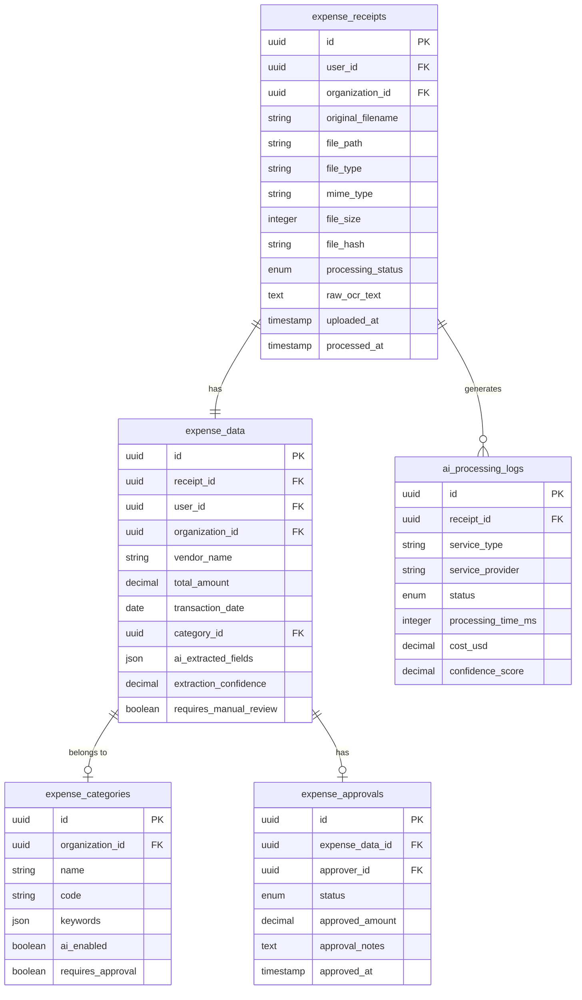

# AI-Powered Receipt Processing System

## Overview

The AI-Powered Receipt Processing System is a comprehensive expense management solution that automatically processes receipt images and PDFs using advanced AI technologies. The system provides OCR (Optical Character Recognition), intelligent data extraction, automated categorization, and workflow management for business expenses.

## Features

### 🤖 AI-Powered Processing
- **OCR Processing**: Google Vision API integration for accurate text extraction from receipts
- **Data Extraction**: DeepSeek Chat integration for structured data extraction
- **Smart Categorization**: AI-powered expense categorization with fallback keyword matching
- **Confidence Scoring**: Quality assessment for extracted data with manual review triggers

### 📁 File Management
- **Secure Upload**: Multi-format support (JPG, PNG, PDF, WebP, GIF)
- **Duplicate Detection**: SHA-256 hash-based duplicate prevention
- **File Optimization**: Automatic image optimization for better OCR results
- **Virus Scanning**: Basic security scanning with placeholder for advanced scanning

### ⚡ Background Processing
- **Queue System**: Redis-backed job queues for scalable processing
- **Retry Logic**: Exponential backoff for failed processing attempts
- **Progress Tracking**: Real-time job status and progress monitoring
- **Batch Processing**: Efficient handling of multiple receipts

### 🔒 Security & Compliance
- **Access Control**: Role-based permissions for different user types
- **Audit Trail**: Comprehensive logging of all processing activities
- **Data Encryption**: Secure storage of sensitive financial information
- **Rate Limiting**: API protection against abuse

### 📊 Workflow Management
- **Approval System**: Multi-level approval workflows for expenses
- **Email Notifications**: Automated notifications to accounting departments
- **Manual Review**: Flagging of low-confidence extractions for human review
- **Cost Tracking**: Monitoring of AI service usage and costs

## Architecture

### Database Schema



### API Endpoints

#### Receipt Management
- `POST /api/expenses/receipts/upload` - Upload receipt files
- `GET /api/expenses/receipts` - List receipts with filtering
- `GET /api/expenses/receipts/:id` - Get receipt details
- `POST /api/expenses/receipts/:id/process` - Trigger manual processing
- `DELETE /api/expenses/receipts/:id` - Delete receipt

#### Approval Workflow
- `POST /api/expenses/receipts/:id/approve` - Approve/reject expenses
- `GET /api/expenses/reports` - Generate expense reports

#### Categories & Configuration
- `GET /api/expenses/categories` - List expense categories
- `GET /api/expenses/queue/status` - Monitor processing queue

## Installation & Setup

### Prerequisites
- Node.js 16+ and npm
- PostgreSQL 12+
- Redis 6+ (for job queues)
- Google Cloud Vision API credentials (optional)
- OpenAI API key (optional)

### Environment Configuration

Create a `.env` file with the following variables:

```env
# AI Services
GOOGLE_CLOUD_PROJECT_ID=your-project-id
GOOGLE_CLOUD_KEY_FILE=path/to/service-account.json
DEEPSEEK_API_KEY=your-deepseek-api-key
DEEPSEEK_MODEL=deepseek-chat

# Redis (Job Queues)
REDIS_HOST=localhost
REDIS_PORT=6379
REDIS_PASSWORD=

# File Upload
RECEIPT_UPLOAD_DIR=uploads/receipts
MAX_RECEIPT_SIZE=10485760
ALLOWED_FILE_TYPES=image/jpeg,image/png,image/gif,image/webp,application/pdf

# Notifications
ACCOUNTING_EMAIL=accounting@yourdomain.com
ACCOUNTING_NOTIFICATION_ENABLED=true

# Processing
OCR_CONFIDENCE_THRESHOLD=0.7
LLM_CONFIDENCE_THRESHOLD=0.6
MANUAL_REVIEW_THRESHOLD=0.7
```

### Database Setup

1. Run migrations to create the database schema:
```bash
npm run migrate
```

2. Seed default expense categories:
```bash
npx knex seed:run --specific=014_expense_categories.js
```

### Dependencies Installation

```bash
npm install @google-cloud/vision openai sharp uuid fs-extra node-cron bull ioredis
```

## Usage

### Basic Receipt Processing

1. **Upload Receipt**:
```javascript
const formData = new FormData();
formData.append('receipt', file);
formData.append('description', 'Business meal');

const response = await fetch('/api/expenses/receipts/upload', {
  method: 'POST',
  headers: {
    'Authorization': `Bearer ${token}`
  },
  body: formData
});
```

2. **Monitor Processing**:
```javascript
const receipt = await fetch(`/api/expenses/receipts/${receiptId}`, {
  headers: { 'Authorization': `Bearer ${token}` }
});

console.log(receipt.processing_status); // 'uploaded', 'processing', 'processed', 'failed'
```

3. **Review Extracted Data**:
```javascript
const details = await fetch(`/api/expenses/receipts/${receiptId}`, {
  headers: { 'Authorization': `Bearer ${token}` }
});

const { vendor_name, total_amount, transaction_date, category_name } = details.receipt;
```

### Approval Workflow

```javascript
// Approve expense (admin/manager only)
await fetch(`/api/expenses/receipts/${receiptId}/approve`, {
  method: 'POST',
  headers: {
    'Authorization': `Bearer ${adminToken}`,
    'Content-Type': 'application/json'
  },
  body: JSON.stringify({
    status: 'approved',
    notes: 'Approved for payment',
    approvedAmount: 45.67
  })
});
```

### Generate Reports

```javascript
// Generate expense report by category
const report = await fetch('/api/expenses/reports?groupBy=category&dateFrom=2024-01-01', {
  headers: { 'Authorization': `Bearer ${adminToken}` }
});

const { summary, breakdown } = await report.json();
```

## AI Processing Pipeline

### 1. OCR Processing
```javascript
// Google Vision API integration
const ocrResults = await aiServices.performOCR(imagePath);
// Returns: { text, confidence, processingTime, detections }
```

### 2. Data Extraction
```javascript
// OpenAI GPT-4 structured extraction
const extractedData = await aiServices.extractReceiptData(ocrText, filename);
// Returns: { vendorName, totalAmount, transactionDate, lineItems, confidence }
```

### 3. Categorization
```javascript
// AI-powered categorization
const category = await aiServices.categorizeExpense(extractedData, categories);
// Returns: { categoryId, categoryName, confidence, reasoning }
```

### 4. Quality Assessment
- Confidence scores for each processing step
- Automatic flagging for manual review
- Error handling and retry logic

## Monitoring & Maintenance

### Queue Monitoring
```javascript
// Check processing queue status
const stats = await fetch('/api/expenses/queue/status', {
  headers: { 'Authorization': `Bearer ${adminToken}` }
});
// Returns: { waiting, active, completed, failed }
```

### Cost Tracking
- OpenAI token usage monitoring
- Google Vision API call tracking
- Cost estimation and budgeting

### Performance Metrics
- Processing success rates
- Average processing times
- Error rates by service

## Testing

### Unit Tests
```bash
# Run receipt processing service tests
npm test tests/services/receiptProcessingService.test.js

# Run API endpoint tests
npm test tests/routes/expenses.test.js
```

### Integration Tests
```bash
# Test complete processing pipeline
npm test tests/integration/receipt-processing.test.js
```

### Manual Testing
```bash
# Test file upload with curl
curl -X POST http://localhost:3001/api/expenses/receipts/upload \
  -H "Authorization: Bearer YOUR_TOKEN" \
  -F "receipt=@test-receipt.jpg" \
  -F "description=Test expense"
```

## Troubleshooting

### Common Issues

1. **OCR Processing Fails**
   - Check Google Cloud credentials
   - Verify image quality and format
   - Review processing logs

2. **LLM Extraction Errors**
   - Validate OpenAI API key
   - Check token limits
   - Review prompt templates

3. **Queue Processing Stuck**
   - Restart Redis service
   - Clear failed jobs
   - Check queue processor logs

4. **File Upload Issues**
   - Verify upload directory permissions
   - Check file size limits
   - Review security scanning

### Debugging

Enable detailed logging:
```env
LOG_LEVEL=debug
NODE_ENV=development
```

Check processing logs:
```sql
SELECT * FROM ai_processing_logs 
WHERE receipt_id = 'your-receipt-id' 
ORDER BY started_at DESC;
```

## Security Considerations

### Data Protection
- Receipt files encrypted at rest
- Secure API key management
- Regular security audits

### Access Control
- Role-based permissions
- Rate limiting
- Input validation

### Compliance
- GDPR compliance for receipt data
- Financial data protection
- Audit trail maintenance

## Performance Optimization

### Image Processing
- Automatic image optimization
- Lazy loading for large files
- Caching of processed results

### Database
- Proper indexing for queries
- Connection pooling
- Query optimization

### Queue Management
- Optimal concurrency settings
- Job prioritization
- Resource monitoring

## Future Enhancements

### Planned Features
- Multiple OCR provider support
- Advanced categorization rules
- Mobile app integration
- Accounting software integration (QuickBooks, Xero)
- Advanced reporting dashboards
- Machine learning model training

### Scalability
- Microservices architecture
- Cloud storage integration
- Horizontal scaling support
- Multi-tenant organization support

## Support

For issues and questions:
- Check the troubleshooting guide
- Review API documentation
- Contact system administrators
- Submit bug reports through the issue tracker

---

*Last updated: January 2025*