# Sports Manager Database Schema

## Entity Relationship Diagram

```mermaid
erDiagram
    %% Core User Management
    users {
        uuid id PK
        string email UK
        string password_hash
        string[] roles
        string first_name
        string last_name
        date date_of_birth
        string phone
        string street_address
        string city
        string province_state
        string postal_zip_code
        string country
        string emergency_contact_name
        string emergency_contact_phone
        integer year_started_refereeing
        json certifications
        json specializations
        enum availability_status
        string organization_id
        date registration_date
        timestamp last_login
        integer profile_completion_percentage
        text admin_notes
        string profile_photo_url
        json communication_preferences
        json banking_info
        boolean is_available
        boolean is_referee
        timestamps created_updated
    }

    %% Sports Management
    leagues {
        uuid id PK
        string organization
        string age_group
        string gender
        string division
        string season
        string level
        timestamps created_updated
    }

    teams {
        uuid id PK
        string name
        uuid league_id FK
        integer rank
        string location
        string contact_email
        string contact_phone
        timestamps created_updated
    }

    games {
        uuid id PK
        uuid home_team_id FK
        uuid away_team_id FK
        uuid league_id FK
        string home_team_name
        string away_team_name
        date game_date
        time game_time
        string location
        string postal_code
        enum level
        decimal pay_rate
        integer refs_needed
        enum status
        timestamps created_updated
    }

    positions {
        uuid id PK
        string name UK
        text description
        timestamps created_updated
    }

    %% Referee Management
    referees {
        uuid id PK
        uuid user_id FK
        string name
        string email UK
        string phone
        string location
        string postal_code
        integer max_distance
        decimal wage_per_game
        boolean is_available
        timestamps created_updated
    }

    referee_levels {
        uuid id PK
        string name UK
        decimal wage_amount
        text description
        json allowed_divisions
        json experience_requirements
        json capability_requirements
        timestamps created_updated
    }

    game_assignments {
        uuid id PK
        uuid game_id FK
        uuid referee_id FK
        uuid position_id FK
        timestamp assigned_at
        uuid assigned_by FK
        enum status
        timestamps created_updated
    }

    referee_availability {
        uuid id PK
        uuid referee_id FK
        date date
        time start_time
        time end_time
        boolean is_available
        string reason
        timestamps created_updated
    }

    %% AI and Automation
    ai_suggestions {
        uuid id PK
        uuid game_id FK
        uuid referee_id FK
        decimal confidence_score
        text reasoning
        decimal proximity_score
        decimal availability_score
        decimal experience_score
        decimal performance_score
        enum status
        text rejection_reason
        uuid created_by FK
        uuid processed_by FK
        timestamp processed_at
        timestamps created_updated
    }

    %% Location Management
    locations {
        uuid id PK
        string name
        string address
        string city
        string province
        string postal_code
        string country
        decimal latitude
        decimal longitude
        integer capacity
        string contact_name
        string contact_phone
        string contact_email
        decimal rental_rate
        integer parking_spaces
        json facilities
        json accessibility_features
        text notes
        boolean is_active
        timestamps created_updated
    }

    user_locations {
        uuid id PK
        uuid user_id FK
        string full_address
        string street_number
        string street_name
        string city
        string province
        string postal_code
        string country
        decimal latitude
        decimal longitude
        string geocoding_provider
        decimal geocoding_confidence
        string address_type
        json raw_geocoding_data
        timestamps created_updated
    }

    %% Financial Management
    game_fees {
        uuid id PK
        uuid game_id FK
        decimal amount
        string payment_status
        timestamp payment_date
        string payment_method
        text notes
        uuid recorded_by FK
        timestamps created_updated
    }

    expense_categories {
        uuid id PK
        uuid organization_id FK
        string name
        string code UK
        text description
        string color_code
        string icon
        uuid parent_category_id FK
        integer sort_order
        json keywords
        json vendor_patterns
        json amount_ranges
        boolean ai_enabled
        boolean requires_approval
        decimal approval_threshold
        boolean reimbursable
        boolean taxable
        boolean active
        json metadata
        timestamps created_updated
    }

    expense_receipts {
        uuid id PK
        uuid user_id FK
        uuid organization_id FK
        string original_filename
        string file_path
        string file_type
        string mime_type
        integer file_size
        string file_hash
        enum processing_status
        text processing_notes
        text raw_ocr_text
        json ai_confidence_scores
        json processing_metadata
        timestamp uploaded_at
        timestamp processed_at
        timestamps created_updated
    }

    expense_data {
        uuid id PK
        uuid receipt_id FK
        uuid user_id FK
        uuid organization_id FK
        string vendor_name
        string vendor_address
        string vendor_phone
        decimal total_amount
        decimal tax_amount
        decimal subtotal_amount
        date transaction_date
        string transaction_time
        string receipt_number
        string payment_method
        uuid category_id FK
        string category_name
        text description
        json line_items
        string business_purpose
        string project_code
        string department
        boolean reimbursable
        json ai_extracted_fields
        decimal extraction_confidence
        json field_confidence_scores
        boolean requires_manual_review
        boolean manually_corrected
        json corrections_made
        uuid corrected_by FK
        timestamp corrected_at
        timestamp extracted_at
        timestamps created_updated
    }

    %% Communication and Content
    invitations {
        uuid id PK
        string email UK
        string first_name
        string last_name
        string role
        uuid invited_by FK
        string token UK
        timestamp expires_at
        boolean used
        timestamp used_at
        timestamps created_updated
    }

    posts {
        uuid id PK
        string title
        text content
        text excerpt
        string status
        string category
        json tags
        uuid author_id FK
        timestamp published_at
        timestamps created_updated
    }

    post_media {
        uuid id PK
        uuid post_id FK
        string file_name
        string file_url
        string file_type
        integer file_size
        string alt_text
        integer sort_order
        timestamps created_updated
    }

    post_reads {
        uuid id PK
        uuid post_id FK
        uuid user_id FK
        timestamp read_at
    }

    post_categories {
        uuid id PK
        string name UK
        string slug UK
        string description
        string icon
        string color
        integer sort_order
        boolean is_active
        timestamps created_updated
    }

    %% RBAC System
    roles {
        uuid id PK
        string name UK
        text description
        boolean is_active
        boolean is_system
        timestamps created_updated
    }

    permissions {
        uuid id PK
        string name UK
        string category
        text description
        boolean is_system
        timestamps created_updated
    }

    role_permissions {
        uuid id PK
        uuid role_id FK
        uuid permission_id FK
        timestamp created_at
        uuid created_by FK
    }

    user_roles {
        uuid id PK
        uuid user_id FK
        uuid role_id FK
        timestamp assigned_at
        uuid assigned_by FK
        timestamp expires_at
        boolean is_active
    }

    role_page_access {
        uuid id PK
        uuid role_id FK
        string page_path
        string page_name
        string page_category
        string page_description
        boolean can_access
        jsonb conditions
        timestamps created_updated
    }

    role_api_access {
        uuid id PK
        uuid role_id FK
        string http_method
        string endpoint_pattern
        string endpoint_category
        string endpoint_description
        boolean can_access
        integer rate_limit
        jsonb conditions
        timestamps created_updated
    }

    role_features {
        uuid id PK
        uuid role_id FK
        string feature_code
        string feature_name
        string feature_category
        string feature_description
        boolean is_enabled
        jsonb configuration
        timestamps created_updated
    }

    role_data_scopes {
        uuid id PK
        uuid role_id FK
        string entity_type
        string scope_type
        jsonb conditions
        string description
        boolean is_active
        timestamps created_updated
    }

    access_control_audit {
        uuid id PK
        uuid user_id FK
        string action_type
        string resource_type
        uuid role_id FK
        string resource_identifier
        jsonb old_value
        jsonb new_value
        string reason
        string ip_address
        string user_agent
        timestamp created_at
    }

    %% Resource Management
    resource_categories {
        uuid id PK
        string name
        string slug UK
        text description
        string icon
        integer order_index
        boolean is_active
        timestamps created_updated
    }

    resources {
        uuid id PK
        uuid category_id FK
        string title
        text description
        string type
        string file_url
        string external_url
        string file_name
        integer file_size
        string mime_type
        jsonb metadata
        integer views
        integer downloads
        boolean is_featured
        boolean is_active
        uuid created_by FK
        uuid updated_by FK
        timestamps created_updated
    }

    resource_access_logs {
        uuid id PK
        uuid resource_id FK
        uuid user_id FK
        string action
        string ip_address
        string user_agent
        timestamp accessed_at
    }

    %% Configuration
    organization_settings {
        uuid id PK
        string organization_name
        enum payment_model
        decimal default_game_rate
        timestamps created_updated
    }

    %% Relationships
    users ||--o{ referees : "has"
    users ||--o{ user_locations : "has"
    users ||--o{ game_assignments : "assigned_by"
    users ||--o{ invitations : "invited_by"
    users ||--o{ posts : "authors"
    users ||--o{ post_reads : "reads"
    users ||--o{ user_roles : "has"
    users ||--o{ expense_receipts : "uploads"
    users ||--o{ expense_data : "submits"
    users ||--o{ ai_suggestions : "created_by"
    users ||--o{ resources : "creates"
    users ||--o{ resource_access_logs : "accesses"

    leagues ||--o{ teams : "contains"
    leagues ||--o{ games : "schedules"

    teams ||--o{ games : "home_team"
    teams ||--o{ games : "away_team"

    games ||--o{ game_assignments : "has"
    games ||--o{ ai_suggestions : "receives"
    games ||--o{ game_fees : "generates"

    referees ||--o{ game_assignments : "assigned_to"
    referees ||--o{ referee_availability : "sets"
    referees ||--o{ ai_suggestions : "suggested_for"

    positions ||--o{ game_assignments : "defines"

    posts ||--o{ post_media : "has"
    posts ||--o{ post_reads : "tracked_by"

    roles ||--o{ role_permissions : "has"
    roles ||--o{ user_roles : "assigned_to"
    roles ||--o{ role_page_access : "defines"
    roles ||--o{ role_api_access : "defines"
    roles ||--o{ role_features : "enables"
    roles ||--o{ role_data_scopes : "scopes"

    permissions ||--o{ role_permissions : "granted_to"

    expense_categories ||--o{ expense_categories : "parent_of"
    expense_categories ||--o{ expense_data : "categorizes"

    expense_receipts ||--o{ expense_data : "extracted_to"

    resource_categories ||--o{ resources : "contains"
    resources ||--o{ resource_access_logs : "tracked_by"
```

## Table Groups

### Core System
- **Users & Authentication**: users, invitations, user_locations
- **Organization**: organization_settings

### Sports Management
- **League Structure**: leagues, teams
- **Game Management**: games, positions, game_assignments
- **Referee System**: referees, referee_levels, referee_availability

### Financial System
- **Game Finance**: game_fees
- **Expense Management**: expense_categories, expense_receipts, expense_data

### AI & Automation
- **AI Suggestions**: ai_suggestions

### Content Management
- **Posts System**: posts, post_media, post_reads, post_categories
- **Resource Center**: resource_categories, resources, resource_access_logs

### Access Control (RBAC)
- **Role Management**: roles, permissions, role_permissions, user_roles
- **Access Control**: role_page_access, role_api_access, role_features, role_data_scopes
- **Auditing**: access_control_audit

### Location Management
- **Venues**: locations
- **User Locations**: user_locations

## Key Relationships

### User-Centric Relationships
1. **users** → **referees**: One-to-one relationship for referee-specific data
2. **users** → **user_roles** → **roles**: Many-to-many relationship for RBAC
3. **users** → **user_locations**: One-to-one relationship for geocoding

### Game Management Flow
1. **leagues** → **teams**: One league has many teams
2. **teams** → **games**: Teams participate in games (home/away)
3. **games** → **game_assignments** → **referees**: Game referee assignments
4. **games** → **ai_suggestions**: AI-powered referee suggestions

### Financial Flow
1. **games** → **game_fees**: Payment tracking for games
2. **expense_receipts** → **expense_data**: Receipt processing and data extraction
3. **expense_categories**: Hierarchical category structure for expenses

### Content & Resources
1. **posts** → **post_media**: Media attachments for posts
2. **posts** → **post_reads**: Read tracking for users
3. **resources** → **resource_access_logs**: Download/view tracking

### RBAC Structure
1. **roles** → **role_permissions** → **permissions**: Role-permission mapping
2. **users** → **user_roles** → **roles**: User-role assignment
3. **roles** → Various access control tables: Page, API, feature, and data access

## Database Design Patterns

### Soft Deletes
- Most tables use `is_active` or status flags instead of hard deletes
- Maintains data integrity and audit trails

### Audit Fields
- All tables include `created_at` and `updated_at` timestamps
- Many include `created_by` and `updated_by` user references

### JSON Fields for Flexibility
- Used for: certifications, specializations, metadata, configurations
- Allows schema flexibility while maintaining structure

### Hierarchical Data
- Self-referencing tables: expense_categories (parent_category_id)
- Enables tree structures for categorization

### Many-to-Many Relationships
- Implemented via junction tables (e.g., user_roles, role_permissions)
- Includes additional metadata (assigned_at, assigned_by)

### Performance Optimization
- Extensive indexing on foreign keys and commonly queried fields
- Composite indexes for complex query patterns
- Unique constraints to ensure data integrity