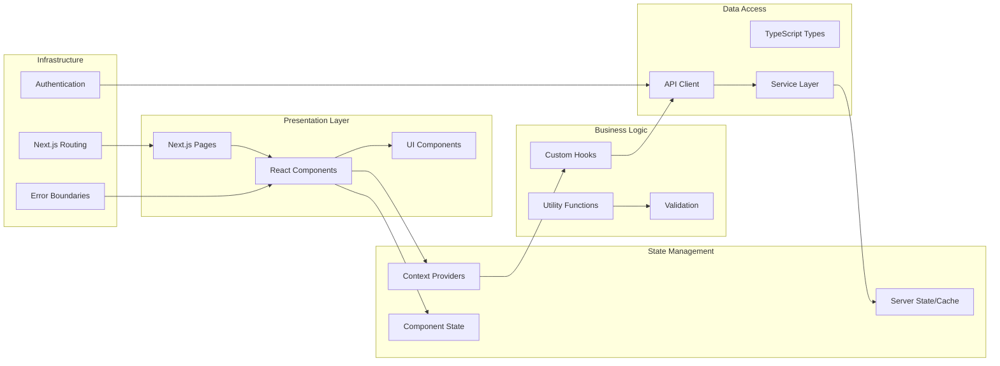
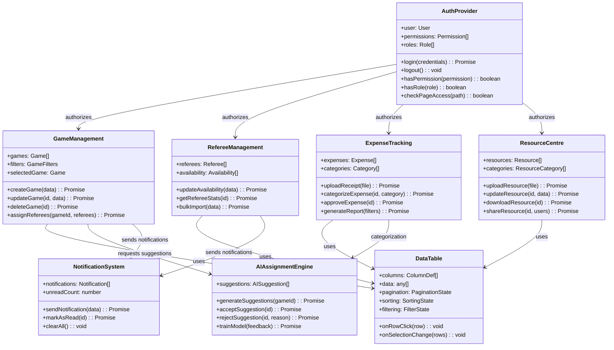
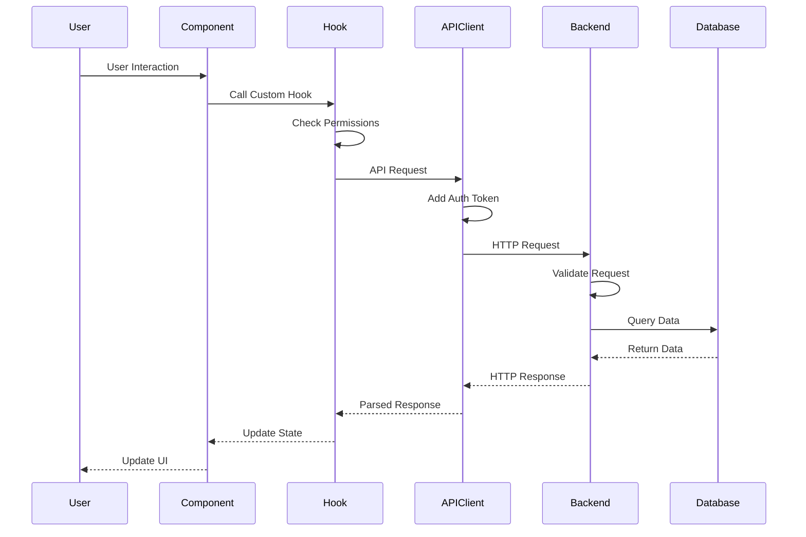
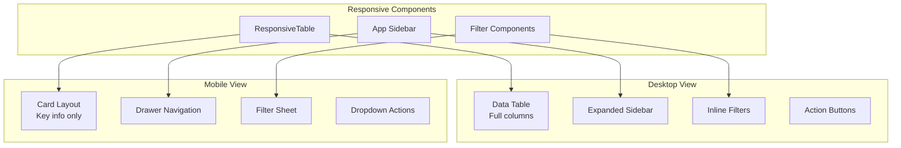
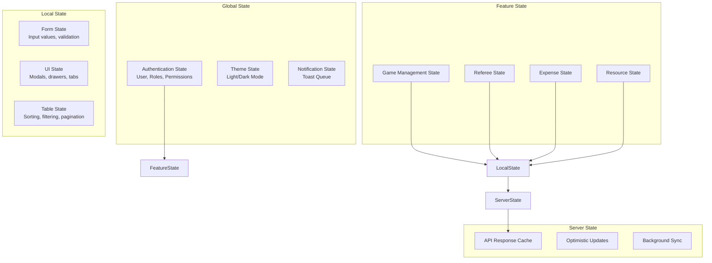
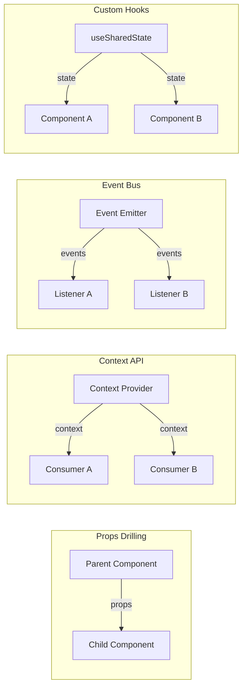

# Sports Manager Frontend Architecture Diagram

## Component Hierarchy Diagram

```mermaid
graph TB
    subgraph "Next.js App Router"
        App[app/layout.tsx<br/>Root Layout]
        App --> ThemeProvider[ThemeProvider]
        ThemeProvider --> ErrorBoundary[ErrorBoundary]
        ErrorBoundary --> AuthProvider[AuthProvider<br/>Authentication & RBAC]
        AuthProvider --> Routes[Route Pages]
    end

    subgraph "Page Routes"
        Routes --> HomePage[page.tsx<br/>Dashboard]
        Routes --> LoginPage[login/page.tsx]
        Routes --> GamesPage[games/page.tsx]
        Routes --> AdminPages[admin/*<br/>9 Admin Pages]
        Routes --> FinancialPages[financial-*/<br/>Financial Management]
        Routes --> ResourcesPages[resources/*<br/>Resource Center]
    end

    subgraph "Component Library"
        UIComponents[ui/<br/>67 Components]
        UIComponents --> FormComponents[Form Controls<br/>Button, Input, Select]
        UIComponents --> LayoutComponents[Layout<br/>Card, Dialog, Sheet]
        UIComponents --> DataComponents[Data Display<br/>Table, Badge, Avatar]
        UIComponents --> NavComponents[Navigation<br/>Breadcrumb, Menu]
        UIComponents --> FeedbackComponents[Feedback<br/>Alert, Toast, Progress]
    end

    subgraph "Feature Components"
        GameMgmt[Game Management]
        GameMgmt --> GamesTable[game-management.tsx]
        GameMgmt --> AssignmentBoard[game-assignment-board.tsx]
        GameMgmt --> AIAssignments[ai-assignments-*.tsx]

        RefereeMgmt[Referee Management]
        RefereeMgmt --> RefereeList[referee-management.tsx]
        RefereeMgmt --> Availability[availability-calendar.tsx]
        RefereeMgmt --> MyAssignments[my-assignments.tsx]

        AdminMgmt[Admin/RBAC]
        AdminMgmt --> RoleManager[admin/rbac/*]
        AdminMgmt --> UserManager[admin/users/*]
        AdminMgmt --> AccessControl[admin/access-control/*]

        FinancialMgmt[Financial Management]
        FinancialMgmt --> ExpenseTracking[expense-*.tsx]
        FinancialMgmt --> BudgetTracking[budget-tracker.tsx]
        FinancialMgmt --> ReceiptUpload[receipt-upload.tsx]

        ResourceMgmt[Resource Management]
        ResourceMgmt --> ResourceCentre[resource-centre.tsx]
        ResourceMgmt --> DocumentRepo[document-repository.tsx]
        ResourceMgmt --> CategoryMgmt[resource-centre/*]

        CommsMgmt[Communications]
        CommsMgmt --> Announcements[announcement-board.tsx]
        CommsMgmt --> Emergency[emergency-broadcast.tsx]
        CommsMgmt --> Notifications[notifications-bell.tsx]
    end

    subgraph "Data Layer"
        APIClient[lib/api.ts<br/>API Client]
        APIClient --> AuthAPI[Authentication]
        APIClient --> GameAPI[Games API]
        APIClient --> RefereeAPI[Referees API]
        APIClient --> AdminAPI[Admin API]
        APIClient --> FinancialAPI[Financial API]
        APIClient --> ResourceAPI[Resources API]
    end

    subgraph "Utilities & Hooks"
        CustomHooks[hooks/]
        CustomHooks --> UsePageAccess[usePageAccess]
        CustomHooks --> UsePermissions[usePermissions]
        CustomHooks --> UseDistance[use-distance]
        CustomHooks --> UseFormState[use-form-state]

        Utils[lib/utilities]
        Utils --> PermissionUtils[permissions.ts]
        Utils --> ThemeUtils[theme-colors.ts]
        Utils --> AddressUtils[address-*.ts]
        Utils --> AIUtils[ai-assignment-algorithm.ts]
    end

    %% Connections
    Routes --> GameMgmt
    Routes --> RefereeMgmt
    Routes --> AdminMgmt
    Routes --> FinancialMgmt
    Routes --> ResourceMgmt
    Routes --> CommsMgmt

    GameMgmt --> UIComponents
    RefereeMgmt --> UIComponents
    AdminMgmt --> UIComponents
    FinancialMgmt --> UIComponents
    ResourceMgmt --> UIComponents
    CommsMgmt --> UIComponents

    GameMgmt --> APIClient
    RefereeMgmt --> APIClient
    AdminMgmt --> APIClient
    FinancialMgmt --> APIClient
    ResourceMgmt --> APIClient
    CommsMgmt --> APIClient

    AuthProvider --> CustomHooks
    AuthProvider --> Utils
```



## Component Architecture Layers



## Key Component Relationships



## Data Flow Architecture



## Mobile-Responsive Architecture



## State Management Pattern



## Component Communication Patterns



## Performance Optimization Strategies

### Code Splitting
- Route-based splitting via Next.js App Router
- Dynamic imports for heavy components
- Lazy loading for optional features

### Rendering Optimization
- React.memo for expensive components
- useMemo/useCallback for computed values
- Virtual scrolling for large lists

### Data Management
- API response caching
- Optimistic UI updates
- Pagination and infinite scroll
- Debounced search inputs

### Asset Optimization
- Next.js Image optimization
- Icon tree-shaking
- CSS purging with Tailwind
- Font subsetting

## Security Architecture

### Client-Side Security
1. **Authentication**: JWT token management
2. **Authorization**: RBAC with permission checking
3. **Input Validation**: Client-side validation
4. **XSS Prevention**: Sanitized user inputs
5. **Protected Routes**: Route guards

### API Security
1. **Token Refresh**: Automatic token renewal
2. **Request Signing**: CSRF protection
3. **Rate Limiting**: Client-side throttling
4. **Error Handling**: Sanitized error messages

## Testing Architecture

### Component Testing
- Unit tests for utilities
- Component testing with React Testing Library
- Integration tests for features
- E2E tests with Playwright

### Test Coverage Areas
- Authentication flows
- RBAC permission checks
- Form validation
- API interactions
- Error boundaries
- Mobile responsiveness

## Build and Deployment

### Build Process
```
1. TypeScript compilation
2. Next.js build optimization
3. Static asset generation
4. API route compilation
5. Production bundle creation
```

### Deployment Architecture
- Static assets → CDN
- Server-side rendering → Node.js server
- API routes → Serverless functions
- Database → PostgreSQL
- Cache → Redis
- File storage → Cloud storage

This comprehensive frontend architecture demonstrates a sophisticated, enterprise-grade sports management application with strong emphasis on user experience, performance, security, and maintainability.