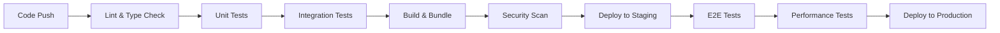

# QA/QC Plan - Sports Management App

## 📋 Current State Assessment

### Testing Infrastructure ✅
- **Backend**: Jest + Supertest setup with 25+ test files
- **Frontend**: Jest + Testing Library configuration 
- **Database**: Knex migrations and seed testing
- **Coverage**: Partial coverage across routes, middleware, and utilities

### Identified Gaps ⚠️
- No CI/CD pipeline
- Inconsistent test data setup causing failures
- No frontend integration tests
- No end-to-end testing
- No code quality gates
- No automated deployment
- No performance testing
- Insufficient test documentation

---

## 🎯 Agent Testing Standards & Guidelines

### Mandatory Requirements for All Agents

#### 1. **Test-First Development**
```bash
# Before implementing any feature, agents MUST:
1. Create failing tests
2. Implement minimal code to pass
3. Refactor while maintaining tests
4. Add edge case tests
```

#### 2. **Test Coverage Requirements**
- **Minimum 80% code coverage** for all new code
- **100% coverage** for critical business logic
- All API endpoints must have complete test suites
- Database operations require transaction testing

#### 3. **Testing Checklist**
Agents must verify ALL items before committing:
- [ ] Unit tests pass locally
- [ ] Integration tests pass
- [ ] No console errors or warnings
- [ ] Database migrations run cleanly
- [ ] TypeScript compilation succeeds
- [ ] Linting passes without errors
- [ ] Manual smoke testing completed

#### 4. **Testing Patterns**
```javascript
// ✅ GOOD - Comprehensive test structure
describe('GameType Feature', () => {
  describe('API Endpoints', () => {
    it('should create game with valid gameType')
    it('should reject invalid gameType values')
    it('should filter games by gameType')
    it('should default to Community when not specified')
  })
  
  describe('Frontend Integration', () => {
    it('should display gameType dropdown in forms')
    it('should update gameType in data table')
    it('should persist gameType selection')
  })
  
  describe('Edge Cases', () => {
    it('should handle missing gameType gracefully')
    it('should validate gameType on form submission')
  })
})
```

---

## 🏗️ CI/CD Pipeline Architecture

### Pipeline Stages



### GitHub Actions Workflow

```yaml
# .github/workflows/ci-cd.yml
name: CI/CD Pipeline

on:
  push:
    branches: [main, develop]
  pull_request:
    branches: [main]

jobs:
  lint-and-typecheck:
    runs-on: ubuntu-latest
    steps:
      - uses: actions/checkout@v4
      - uses: actions/setup-node@v4
        with:
          node-version: '18'
          cache: 'npm'
      
      # Frontend
      - run: npm ci
      - run: npm run lint
      - run: npm run build
      
      # Backend
      - run: cd backend && npm ci
      - run: cd backend && npm run lint (when configured)

  test-backend:
    runs-on: ubuntu-latest
    services:
      postgres:
        image: postgres:14
        env:
          POSTGRES_PASSWORD: test
          POSTGRES_DB: sports_management_test
        options: >-
          --health-cmd pg_isready
          --health-interval 10s
          --health-timeout 5s
          --health-retries 5
    
    steps:
      - uses: actions/checkout@v4
      - uses: actions/setup-node@v4
      - run: cd backend && npm ci
      - run: cd backend && npm run migrate
      - run: cd backend && npm test -- --coverage
      - uses: codecov/codecov-action@v3

  test-frontend:
    runs-on: ubuntu-latest
    steps:
      - uses: actions/checkout@v4
      - uses: actions/setup-node@v4
      - run: npm ci
      - run: npm test -- --coverage

  e2e-tests:
    runs-on: ubuntu-latest
    steps:
      - uses: actions/checkout@v4
      - uses: cypress-io/github-action@v6
        with:
          start: npm run dev
          wait-on: 'http://localhost:3000'

  deploy-staging:
    if: github.ref == 'refs/heads/develop'
    needs: [lint-and-typecheck, test-backend, test-frontend]
    runs-on: ubuntu-latest
    # Deployment steps here

  deploy-production:
    if: github.ref == 'refs/heads/main'
    needs: [lint-and-typecheck, test-backend, test-frontend, e2e-tests]
    runs-on: ubuntu-latest
    # Production deployment steps
```

---

## 🔍 Quality Gates & Approval Process

### Automated Quality Gates
1. **Code Quality Gate**
   - ESLint: 0 errors, warnings < 10
   - TypeScript: 0 compilation errors
   - Prettier: Code formatted correctly

2. **Test Quality Gate**
   - Unit test coverage ≥ 80%
   - Integration test coverage ≥ 70%  
   - All tests pass
   - No flaky tests (3+ consecutive runs)

3. **Security Gate**
   - No high/critical vulnerabilities
   - Dependencies up to date
   - No secrets in code

4. **Performance Gate**
   - Bundle size increase < 10%
   - API response times < 500ms
   - Database queries optimized

### Manual Review Requirements
- **Code Review**: 2 approvals for main branch
- **Architecture Review**: For major changes
- **Security Review**: For auth/data changes
- **UX Review**: For UI/UX modifications

---

## 🛠️ Recommended Testing Framework Enhancements

### Backend Testing Stack
```json
{
  "dependencies": {
    "jest": "^29.7.0",
    "supertest": "^6.3.3",
    "jest-extended": "^4.0.2",
    "@testcontainers/postgresql": "^10.2.2"
  }
}
```

### Frontend Testing Stack
```json
{
  "dependencies": {
    "@testing-library/react": "^14.1.2",
    "@testing-library/jest-dom": "^6.1.5",
    "@testing-library/user-event": "^14.5.1",
    "msw": "^2.0.0",
    "cypress": "^13.6.0",
    "@storybook/react": "^7.6.0"
  }
}
```

### Database Testing Strategy
```javascript
// tests/setup.js - Enhanced setup
const { GenericContainer } = require('@testcontainers/postgresql');

let postgresContainer;
beforeAll(async () => {
  postgresContainer = await new GenericContainer('postgres:14')
    .withExposedPorts(5432)
    .withEnvironment({
      POSTGRES_DB: 'test_db',
      POSTGRES_USER: 'test_user',
      POSTGRES_PASSWORD: 'test_pass'
    })
    .start();
    
  process.env.DB_HOST = postgresContainer.getHost();
  process.env.DB_PORT = postgresContainer.getMappedPort(5432);
});

afterAll(async () => {
  await postgresContainer.stop();
});
```

---

## 📝 Agent Code Quality Standards

### TypeScript Standards
```typescript
// ✅ GOOD - Proper typing
interface GameTypeRequest {
  gameType: 'Community' | 'Club' | 'Tournament' | 'Private Tournament';
  // other fields...
}

// ❌ BAD - Using any
function createGame(data: any) { }
```

### Error Handling Standards
```javascript
// ✅ GOOD - Comprehensive error handling
try {
  const game = await db('games').insert(gameData).returning('*');
  return { success: true, data: game[0] };
} catch (error) {
  logger.error('Game creation failed:', error);
  if (error.code === '23505') {
    return { success: false, error: 'Game already exists' };
  }
  throw new DatabaseError('Failed to create game');
}
```

### API Response Standards
```javascript
// ✅ GOOD - Consistent response format
{
  "success": true,
  "data": { /* actual data */ },
  "pagination": { "page": 1, "limit": 50, "total": 100 },
  "meta": { "timestamp": "2025-01-01T00:00:00Z" }
}

// Error responses
{
  "success": false,
  "error": "Validation failed",
  "details": [{ "field": "gameType", "message": "Invalid value" }]
}
```

---

## 🚀 Deployment Strategy

### Environment Structure
```
┌─ Production (main)
├─ Staging (develop) 
├─ Feature Branches
└─ Local Development
```

### Deployment Requirements
1. **Zero-downtime deployments**
2. **Database migration safety**
3. **Rollback capability**
4. **Health checks**
5. **Monitoring & alerting**

### Pre-deployment Checklist
- [ ] All tests pass in CI
- [ ] Database migrations tested
- [ ] Environment variables updated
- [ ] Performance regression tests pass
- [ ] Security scan clean
- [ ] Backup verified

---

## 📊 Monitoring & Reporting

### Test Reporting
- **Coverage reports** in PR comments
- **Performance regression** alerts
- **Test execution time** tracking
- **Flaky test** identification

### Quality Metrics Dashboard
- Code coverage trends
- Test execution times
- Bug escape rate
- Deployment frequency
- Mean time to recovery

---

## 🎓 Agent Training Requirements

### Before Contributing
1. **Read this QA/QC plan thoroughly**
2. **Complete testing workshop** (TBD)
3. **Practice on sample features**
4. **Shadow experienced agent**

### Ongoing Education
- Monthly testing best practices sessions
- Code review participation
- Test architecture discussions
- Performance optimization workshops

---

## 🔄 Implementation Phases

### Phase 1: Foundation (Week 1-2)
- [ ] Fix existing test infrastructure
- [ ] Set up GitHub Actions CI
- [ ] Implement code quality gates
- [ ] Create test data management

### Phase 2: Enhancement (Week 3-4)
- [ ] Add E2E testing with Cypress
- [ ] Implement performance testing
- [ ] Set up staging environment
- [ ] Create deployment automation

### Phase 3: Optimization (Week 5-6)
- [ ] Advanced monitoring
- [ ] Test parallelization
- [ ] Visual regression testing
- [ ] Load testing integration

---

## 📞 Support & Resources

### Getting Help
- **QA Team Lead**: [Contact info]
- **Testing Documentation**: /docs/testing/
- **CI/CD Issues**: GitHub Issues with `ci/cd` label
- **Test Template Examples**: /templates/testing/

### Tools & Resources
- **Testing Guide**: [Link to detailed guide]
- **Best Practices**: [Internal wiki]
- **Video Tutorials**: [Training portal]
- **Code Review Checklist**: [Checklist template]

---

*This document is a living standard. All agents must follow these guidelines and contribute to their improvement.*

**Last Updated**: January 2025  
**Next Review**: February 2025  
**Version**: 1.0