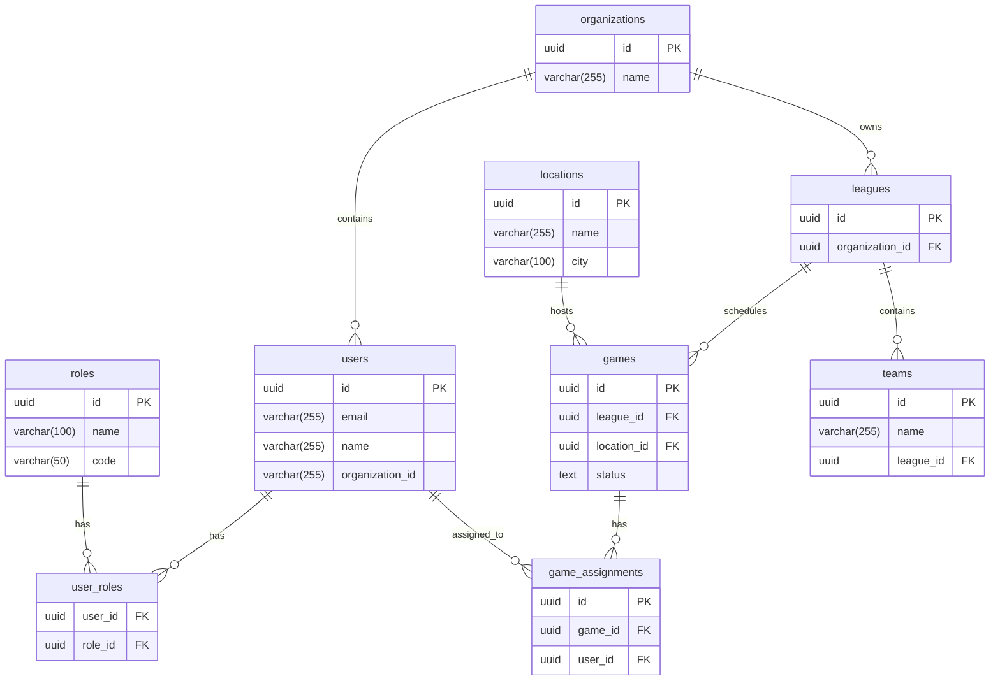

# Database Entity Relationship Diagram

**Database**: sports_management
**Generated**: 2025-10-18, 3:35:32 p.m.

---

## Complete ERD

```mermaid
erDiagram

  %% AI & Machine Learning
  ai_processing_logs {
    uuid id PK
    uuid receipt_id FK
    uuid user_id FK
    uuid organization_id FK
    text status
  }
  ai_suggestions {
    uuid id PK
    uuid game_id FK
    uuid referee_id FK
    text status
    uuid created_by FK
    uuid processed_by FK
  }

  %% Approval Workflows
  approval_requests {
    uuid id PK
    uuid organization_id FK
    uuid workflow_id FK
    uuid requested_by FK
    text status
  }
  approval_workflows {
    uuid id PK
    uuid organization_id FK
  }

  %% Assets & Resources
  asset_checkouts {
    uuid id PK
    uuid asset_id FK
    uuid employee_id FK
    uuid checked_out_by FK
    uuid checked_in_by FK
    varchar(30) status
  }
  asset_maintenance {
    uuid id PK
    uuid asset_id FK
    uuid performed_by FK
    varchar(30) status
  }
  assets {
    uuid id PK
    varchar(200) name
    uuid location_id FK
    uuid assigned_to FK
    varchar(30) status
  }

  %% Authentication & Security
  access_control_audit {
    uuid id PK
    uuid user_id FK
    uuid role_id FK
  }
  audit_logs {
    integer id PK
    uuid user_id FK
  }
  resource_access_logs {
    uuid id PK
    uuid resource_id FK
    uuid user_id FK
  }
  resource_audit_log {
    uuid id PK
    uuid resource_id FK
    uuid category_id FK
    uuid user_id FK
  }

  %% Communications
  communication_recipients {
    uuid id PK
    uuid communication_id FK
    uuid recipient_id FK
  }
  internal_communications {
    uuid id PK
    varchar(200) title
    varchar(30) type
    uuid author_id FK
    varchar(30) status
  }
  invitations {
    uuid id PK
    varchar(255) email
    uuid invited_by FK
  }
  notification_preferences {
    uuid user_id PK FK
  }
  notifications {
    uuid id PK
    uuid user_id FK
    varchar(50) type
    varchar(255) title
  }

  %% Compliance & Tracking
  compliance_tracking {
    uuid id PK
    uuid responsible_employee FK
    uuid responsible_department FK
    varchar(30) status
  }
  risk_assessments {
    uuid id PK
    uuid owner_employee FK
    uuid owner_department FK
    varchar(30) status
  }

  %% Documents & Content
  content_analytics {
    integer id PK
    integer content_item_id FK
    uuid user_id FK
  }
  content_analytics_monthly {
    integer id PK
    integer content_item_id FK
  }
  content_attachments {
    integer id PK
    integer content_item_id FK
    uuid uploaded_by FK
  }
  content_categories {
    integer id PK
    varchar(255) name
    integer parent_id FK
  }
  content_item_tags {
    integer id PK
    integer content_item_id FK
    integer tag_id FK
  }
  content_items {
    integer id PK
    varchar(500) title
    text type
    text status
    integer category_id FK
    uuid author_id FK
  }
  content_permissions {
    integer id PK
    integer content_item_id FK
    uuid user_id FK
    uuid granted_by FK
  }
  content_search_index {
    integer content_item_id PK FK
  }
  content_tags {
    integer id PK
    varchar(100) name
  }
  content_versions {
    integer id PK
    integer content_item_id FK
    varchar(500) title
    uuid created_by FK
  }
  document_access {
    uuid id PK
    uuid document_id FK
    uuid user_id FK
  }
  document_acknowledgments {
    uuid id PK
    uuid document_id FK
    uuid user_id FK
  }
  document_versions {
    uuid id PK
    uuid document_id FK
    uuid uploaded_by FK
  }
  documents {
    uuid id PK
    varchar(200) title
    uuid uploaded_by FK
    uuid approved_by FK
    varchar(30) status
  }
  post_categories {
    uuid id PK
    varchar(100) name
  }
  post_media {
    uuid id PK
    uuid post_id FK
  }
  post_reads {
    uuid id PK
    uuid post_id FK
    uuid user_id FK
  }
  posts {
    uuid id PK
    varchar(255) title
    varchar(20) status
    uuid author_id FK
  }
  resource_categories {
    uuid id PK
    varchar(100) name
    uuid created_by FK
    uuid managed_by FK
  }
  resource_category_managers {
    uuid id PK
    uuid category_id FK
    uuid user_id FK
    uuid assigned_by FK
  }
  resource_versions {
    uuid id PK
    uuid resource_id FK
    varchar(255) title
    uuid created_by FK
  }
  resources {
    uuid id PK
    uuid category_id FK
    varchar(255) title
    varchar(50) type
    uuid created_by FK
    uuid updated_by FK
    uuid published_by FK
  }

  %% Employee Management
  employee_evaluations {
    uuid id PK
    uuid employee_id FK
    uuid evaluator_id FK
    varchar(30) status
  }
  employees {
    uuid id PK
    uuid user_id FK
    uuid department_id FK
    uuid position_id FK
    uuid manager_id FK
  }
  training_records {
    uuid id PK
    uuid employee_id FK
    varchar(30) status
  }

  %% Financial
  accounting_integrations {
    uuid id PK
    uuid organization_id FK
  }
  accounting_sync_logs {
    uuid id PK
    uuid organization_id FK
    uuid integration_id FK
    text status
  }
  budget_alerts {
    uuid id PK
    uuid organization_id FK
    uuid budget_id FK
    varchar(255) title
    uuid acknowledged_by FK
  }
  budget_approvals {
    uuid id PK
    uuid budget_id FK
    uuid requested_by FK
    uuid approver_id FK
    text status
  }
  budget_categories {
    uuid id PK
    uuid organization_id FK
    varchar(255) name
    varchar(255) code
    uuid parent_id FK
    uuid default_account_id FK
  }
  budget_forecasts {
    uuid id PK
    uuid organization_id FK
    uuid budget_id FK
  }
  budget_periods {
    uuid id PK
    uuid organization_id FK
    varchar(255) name
    text status
    uuid created_by FK
  }
  budgets {
    uuid id PK
    uuid organization_id FK
    uuid budget_period_id FK
    uuid category_id FK
    varchar(255) name
    text status
    uuid owner_id FK
  }
  cash_flow_forecasts {
    uuid id PK
    uuid organization_id FK
    uuid budget_period_id FK
  }
  chart_of_accounts {
    uuid id PK
    uuid organization_id FK
    uuid parent_account_id FK
  }
  company_credit_cards {
    uuid id PK
    uuid organization_id FK
    uuid primary_holder_id FK
    uuid blocked_by FK
    uuid created_by FK
    uuid updated_by FK
  }
  expense_approvals {
    uuid id PK
    uuid expense_data_id FK
    uuid receipt_id FK
    uuid user_id FK
    uuid organization_id FK
    text status
    uuid approver_id FK
  }
  expense_categories {
    uuid id PK
    uuid organization_id FK
    varchar(255) name
    varchar(255) code
    uuid parent_category_id FK
  }
  expense_data {
    uuid id PK
    uuid receipt_id FK
    uuid user_id FK
    uuid organization_id FK
    uuid category_id FK
    uuid corrected_by FK
    uuid budget_id FK
    uuid transaction_id FK
    string "... 65 more columns"
  }
  expense_receipts {
    uuid id PK
    uuid user_id FK
    uuid organization_id FK
  }
  expense_reimbursements {
    uuid id PK
    uuid expense_data_id FK
    uuid receipt_id FK
    uuid reimbursement_user_id FK
    uuid organization_id FK
    text status
    uuid processed_by FK
  }
  financial_audit_trail {
    uuid id PK
    uuid organization_id FK
    uuid user_id FK
  }
  financial_dashboards {
    uuid id PK
    uuid organization_id FK
    uuid user_id FK
  }
  financial_insights {
    uuid id PK
    uuid organization_id FK
    varchar(255) title
    text status
    uuid reviewed_by FK
  }
  financial_kpis {
    uuid id PK
    uuid organization_id FK
  }
  financial_reports_config {
    uuid id PK
    uuid organization_id FK
    uuid created_by FK
  }
  financial_transactions {
    uuid id PK
    uuid organization_id FK
    uuid budget_id FK
    uuid expense_data_id FK
    uuid payroll_assignment_id FK
    uuid vendor_id FK
    uuid created_by FK
    text status
    string "... 12 more columns"
  }
  journal_entries {
    uuid id PK
    uuid organization_id FK
    uuid transaction_id FK
    text status
    uuid created_by FK
    uuid approved_by FK
  }
  journal_entry_lines {
    uuid id PK
    uuid journal_entry_id FK
    uuid account_id FK
  }
  payment_methods {
    uuid id PK
    uuid organization_id FK
    varchar(255) name
    text type
    uuid created_by FK
    uuid updated_by FK
  }
  purchase_orders {
    uuid id PK
    uuid organization_id FK
    uuid requested_by FK
    text status
    uuid approved_by FK
    uuid budget_id FK
  }
  spending_limits {
    uuid id PK
    uuid organization_id FK
    uuid user_id FK
    uuid budget_category_id FK
  }
  vendors {
    uuid id PK
    uuid organization_id FK
    varchar(255) name
    varchar(255) email
  }

  %% Games & Assignments
  ai_assignment_partner_preferences {
    uuid id PK
    uuid rule_id FK
    uuid referee1_id FK
    uuid referee2_id FK
  }
  ai_assignment_rule_runs {
    uuid id PK
    uuid rule_id FK
    text status
  }
  ai_assignment_rules {
    uuid id PK
    varchar(255) name
  }
  assignment_patterns {
    uuid id PK
    uuid referee_id FK
  }
  chunk_games {
    uuid id PK
    uuid chunk_id FK
    uuid game_id FK
  }
  game_assignments {
    uuid id PK
    uuid game_id FK
    uuid position_id FK
    uuid assigned_by FK
    text status
    uuid user_id FK
    uuid payroll_transaction_id FK
  }
  game_chunks {
    uuid id PK
    varchar(255) name
    uuid assigned_referee_id FK
    text status
    uuid created_by FK
    uuid assigned_by FK
  }
  game_fees {
    uuid id PK
    uuid game_id FK
    uuid recorded_by FK
  }
  games {
    uuid id PK
    text status
    uuid home_team_id FK
    uuid away_team_id FK
    uuid league_id FK
    uuid location_id FK
  }

  %% Locations & Facilities
  budget_allocations {
    uuid id PK
    uuid budget_id FK
  }
  locations {
    uuid id PK
    varchar(255) name
  }

  %% Mentorship
  mentorship_documents {
    uuid id PK
    uuid mentorship_id FK
    uuid uploaded_by FK
  }
  mentorship_notes {
    uuid id PK
    uuid mentorship_id FK
    uuid author_id FK
    varchar(255) title
  }
  mentorships {
    uuid id PK
    uuid mentor_id FK
    uuid mentee_id FK
    text status
  }

  %% Organizations
  departments {
    uuid id PK
    varchar(100) name
    uuid parent_department_id FK
    uuid manager_id FK
  }
  organization_settings {
    uuid id PK
  }
  organizations {
    uuid id PK
    varchar(255) name
    uuid parent_organization_id FK
  }

  %% RBAC & Permissions
  rbac_configuration_templates {
    integer id PK
  }
  rbac_endpoints {
    integer id PK
  }
  rbac_functions {
    integer id PK
  }
  rbac_pages {
    integer id PK
  }
  rbac_scan_history {
    integer id PK
    text status
  }
  referee_roles {
    uuid id PK
    varchar(255) name
  }
  resource_category_permissions {
    uuid id PK
    uuid category_id FK
    uuid role_id FK
    uuid created_by FK
  }
  resource_permissions {
    uuid id PK
    uuid resource_id FK
    uuid role_id FK
    uuid created_by FK
  }
  role_api_access {
    uuid id PK
    uuid role_id FK
  }
  role_data_scopes {
    uuid id PK
    uuid role_id FK
  }
  role_features {
    uuid id PK
    uuid role_id FK
  }
  role_page_access {
    uuid id PK
    uuid role_id FK
  }
  roles {
    uuid id PK
    varchar(100) name
    varchar(50) code
  }

  %% Referees & Officials
  incidents {
    uuid id PK
    uuid location_id FK
    uuid reported_by FK
    uuid assigned_investigator FK
    varchar(30) status
  }
  referee_levels {
    uuid id PK
    varchar(255) name
  }
  referee_profiles {
    uuid id PK
    uuid user_id FK
  }

  %% Teams & Leagues
  job_positions {
    uuid id PK
    varchar(100) title
    uuid department_id FK
  }
  leagues {
    uuid id PK
    uuid organization_id FK
  }
  positions {
    uuid id PK
    varchar(100) name
  }
  teams {
    uuid id PK
    varchar(255) name
    uuid league_id FK
    uuid organization_id FK
  }

  %% User Management
  user_earnings {
    uuid id PK
    uuid user_id FK
    uuid organization_id FK
    uuid processed_by FK
  }
  user_location_distances {
    uuid id PK
    uuid user_id FK
    uuid location_id FK
  }
  user_locations {
    uuid id PK
    uuid user_id FK
  }
  user_referee_roles {
    uuid id PK
    uuid user_id FK
    uuid referee_role_id FK
    uuid assigned_by FK
  }
  user_roles {
    uuid id PK
    uuid user_id FK
    uuid role_id FK
    uuid assigned_by FK
  }
  users {
    uuid id PK
    varchar(255) email
    varchar(255) name
    uuid referee_level_id FK
  }

  %% Relationships

  budgets ||--o{ users : "organization_id"
  budgets ||--o{ users : "owner_id"
  documents ||--o{ users : "approved_by"
  documents ||--o{ users : "uploaded_by"
  employees ||--o{ employees : "manager_id"
  employees ||--o{ users : "user_id"
  game_assignments ||--o{ users : "assigned_by"
  game_assignments ||--o{ games : "game_id"
  game_assignments ||--o{ users : "user_id"
  games ||--o{ teams : "away_team_id"
  games ||--o{ teams : "home_team_id"
  games ||--o{ leagues : "league_id"
  games ||--o{ locations : "location_id"
  leagues ||--o{ organizations : "organization_id"
  mentorships ||--o{ users : "mentee_id"
  mentorships ||--o{ users : "mentor_id"
  notifications ||--o{ users : "user_id"
  organizations ||--o{ organizations : "parent_organization_id"
  referee_profiles ||--o{ users : "user_id"
  teams ||--o{ leagues : "league_id"
  teams ||--o{ organizations : "organization_id"
  user_roles ||--o{ users : "assigned_by"
  user_roles ||--o{ roles : "role_id"
  user_roles ||--o{ users : "user_id"
  users ||--o{ referee_levels : "referee_level_id"
```

---

## Core Entities (Simplified)

This diagram shows only the most critical tables and relationships:



---

*Generated automatically on 2025-10-18, 3:35:32 p.m.*